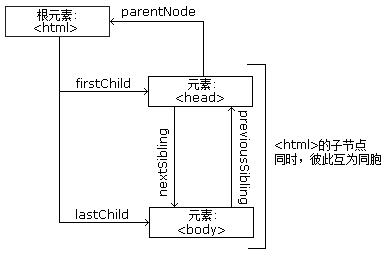

# HTML DOM

---

### 在 HTML DOM 中，所有事物都是节点。DOM 是被视为节点树的 HTML。

---

### DOM 节点

根据 W3C 的 HTML DOM 标准，HTML 文档中的所有内容都是节点：

* 整个文档是一个文档节点
* 每个 HTML 元素是元素节点
* HTML 元素内的文本是文本节点
* 每个 HTML 属性是属性节点
* 注释是注释节点

---

### HTML DOM 节点树

HTML DOM 将 HTML 文档视作树结构。这种结构被称为节点树：

HTML DOM Tree


通过 HTML DOM，树中的所有节点均可通过 JS 进行访问。所有 HTML 元素（节点）均可被修改，也可以创建或删除节点。

---

### 节点父、子和同胞

节点树中的节点彼此拥有层级关系。

父（parent）、子（child）和同胞（sibling）等术语用于描述这些关系。父节点拥有子节点。同级的子节点被称为同胞。

* 在节点树中，顶端节点被称为根 root
* 每个节点都有父节点、除了根
* 一个节点可拥有任意数量的子
* 同胞是拥有相同父节点的节点

下面的图片展示了节点树的一部分，以及节点之间的关系



---

### 请看下面的 HTML 片段：

```
<html>
  <head>
    <title>DOM 教程</title>
  </head>
  <body>
    <h1>DOM 第一课</h1>
    <p>Hello world!</p>
  </body>
</html>
```

从上面的 HTML 中：

* &lt;html&gt; 节点没有父节点，它是根节点
* &lt;head&gt; 和 &lt;body&gt; 的父节点是 &lt;html&gt; 节点
* 文本节点 "Hello world!" 的父节点是 &lt;p&gt; 节点

并且：

* &lt;html&gt; 节点拥有两个子节点：&lt;head&gt; 和 &lt;body&gt;
* &lt;head&gt; 节点拥有一个子节点：&lt;title&gt; 节点
* &lt;title&gt; 节点也拥有一个子节点：文本节点 "DOM 教程"
* &lt;h1&gt; 和 &lt;p&gt; 节点是同胞节点，同时也是 &lt;body&gt; 的子节点

并且：

* &lt;head&gt; 元素是 &lt;html&gt; 元素的首个子节点
* &lt;body&gt; 元素是 &lt;html&gt; 元素的最后一个子节点
* &lt;h1&gt; 元素是 &lt;body&gt; 元素的首个子节点
* &lt;p&gt; 元素是 &lt;body&gt; 元素的最后一个子节点

---

### 警告

DOM 处理中的常见错误是希望元素节点包含文本

在本例中：&lt;title&gt;DOM 教程&lt;/title&gt;，元素节点 &lt;title&gt;，包含值为 "DOM 教程" 的文本节点。

可通过节点的 innerHTML 属性来访问文本节点的值。

---
