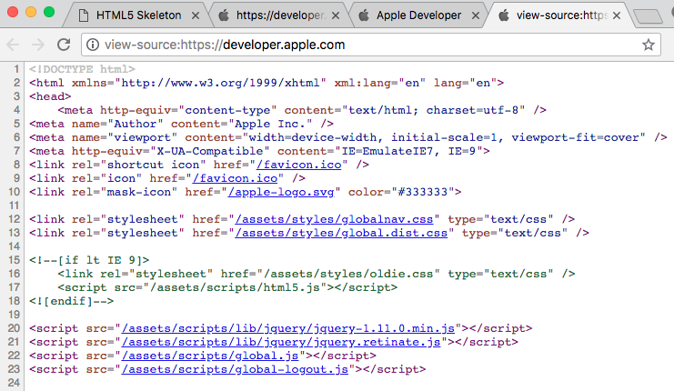
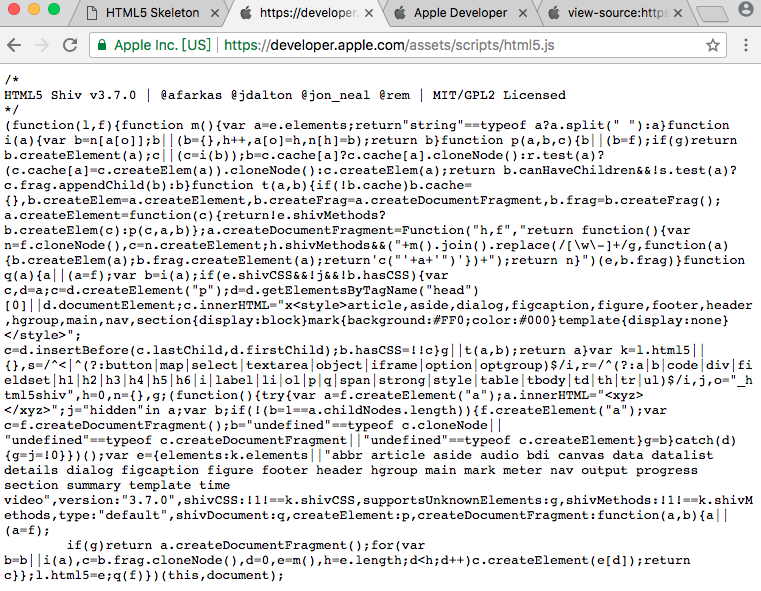

# HTML5 浏览器支持

---

### 您可以帮助老版本浏览器处理 HTML5

---

### HTML5 浏览器支持

所有现代浏览器都支持 HTML5。

此外，所有浏览器，不论新旧，都会自动把未识别元素当做行内元素来处理。

正因如此，您可以帮助老式浏览器处理 "未知的" HTML 元素。

注释：甚至可以教授远古版本的 IE6 如何处理未知的 HTML 元素。

---

### 把 HTML5 元素定义为块级元素

HTML5 定义了八个新的语义 HTML 元素。所有都是块级元素。

您可以把 CSS display 属性设置为 block，以确保老式浏览器中正确的行为：

```
header, section, footer, aside, nav, main, article, figure {
    display: block; 
}
```

---

### 向 HTML 添加新元素

您可以通过浏览器 trick 向 HTML 添加任何新元素：

本例向 HTML 添加了一个名为 &lt;myHero&gt; 的新元素，并为其定义 display 样式：

```
<!DOCTYPE html>
<html>

<head>
    <title>Creating an HTML Element</title>
    <script>document.createElement("myHero")</script>
    <style>
        myHero {
            display: block;
            background-color: #ddd;
            padding: 50px;
            font-size: 30px;
        } 
    </style> 
</head>

<body>

    <h1>My First Heading</h1>

    <p>My first paragraph.</p>

    <myHero>My First Hero</myHero>

</body>
</html>
```

---

### Internet Explorer 的问题

上述方案可用于所有新的 HTML5 元素，但是：

注意：Internet Explorer 8 以及更早的版本，不允许对未知元素添加样式。

幸运的是，Sjoerd Visscher 创造了 "HTML5 Enabling JavaScript"：

```
<!--[if lt IE 9]>
  <script src="http://html5shiv.googlecode.com/svn/trunk/html5.js"></script>
<![endif]-->
```

以上代码是一段注释，但是 IE9 的早期版本会读取它（并理解它）。

---

### 完整的 Shiv 解决方案

```
<!DOCTYPE html>
<html>
<head>
    <title>Styling HTML5</title>
    <!--[if lt IE 9]>
    <script src="http://html5shiv.googlecode.com/svn/trunk/html5.js"></script>
    <![endif]-->
</head>
<body>
    <h1>My First Article</h1>
    <article>
    London is the capital city of England. 
    It is the most populous city in the United Kingdom, 
    with a metropolitan area of over 13 million inhabitants.
    </article>
</body>
</html>
```

引用 shiv 代码的链接必须位于 &lt;head&gt; 元素中，因为 Internet Explorer 需要在读取之前认识所有新元素。

---

### 苹果的解决方案

在 [Apple 开发者网站](https://developer.apple.com/)，苹果也采用了类似的解决方案。

我们查看网页源代码可以发现：




