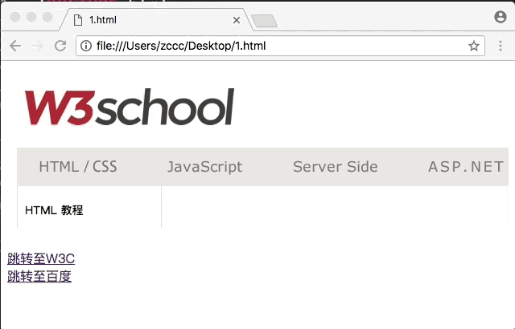

# HTML 内联框架

---

### iframe 用于在网页内显示网页。

---

### 消除内联框架边框

使用内联框架的 frameborder 属性可以设置内联框架的边框

```
<iframe src="http://www.w3school.com.cn" frameborder="0"><iframe>
```

---

### 设置内联框架尺寸

使用 width、height 属性可以设置内联框架的尺寸。

```
<iframe src="http://www.w3school.com.cn" frameborder="0" width="100%" height="200"><iframe>
```

注释：尺寸不仅可以设置像素点，也可以设置为屏幕的百分比！

---

### 为内联框架命名锚点，将内联框架作为跳转的窗口

```
<!DOCTYPE html>
<html>
<head>
  <title></title>
</head>
<body>
    <iframe src="https://www.baidu.com" frameborder="0" width="100%" height="200" name="showframe"></iframe>
    <br />
    <br />
    <a href="http://www.w3school.com.cn" target="showframe">跳转至W3C</a>
    <br />
    <a href="https://www.baidu.com" target="showframe">跳转至百度</a>
</body>
</html>
```

效果：


