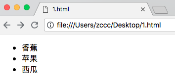
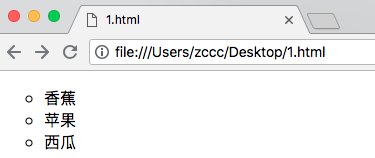
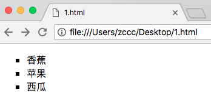
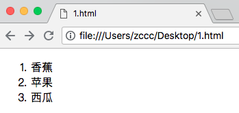
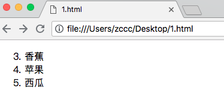
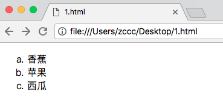
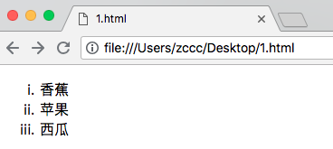
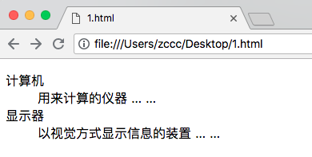

# HTML 列表

---

### HTML 支持有序列表、无序列表、定义列表

---

### 无序列表

无序列表是一个项目的列表，此列项目使用粗体圆点（小黑圈）进行标记。

无序列表始于 &lt;ul&gt; 标签，每个列表项始于 &lt;li&gt; 标签。

列表项内部可以使用段落、换行符、图片、链接以及其他列表等等。

---

### 有序列表

同样，有序列表也是一列项目，列表项目使用数字、字母、罗马字母等进行标记。

有序列表始于 &lt;ol&gt; 标签，每个列表项始于 &lt;li&gt; 标签。

列表项内部可以使用段落、换行符、图片、链接以及其他列表等等。

---

### 定义列表

自定义列表不仅仅是一列项目，而是项目及其注释的组合。

自定义列表以 &lt;dl&gt; 标签开始，每个自定义列表项以 &lt;dt&gt; 标签开始，每个自定义列表项的定义以 &lt;dd&gt; 标签开始。

列表项内部可以使用段落、换行符、图片、链接以及其他列表等等。

---

# 实例

### 无序列表

```
<ul type="disc">
	<li>香蕉</li>
	<li>苹果</li>
	<li>西瓜</li>
</ul>
```

效果：



```
<ul type="circle">
	<li>香蕉</li>
	<li>苹果</li>
	<li>西瓜</li>
</ul>
```

效果：



```
<ul type="square">
	<li>香蕉</li>
	<li>苹果</li>
	<li>西瓜</li>
</ul>
```

效果：



---

### 有序列表

```
<ol>
	<li>香蕉</li>
	<li>苹果</li>
	<li>西瓜</li>
</ol>
```

效果：



```
<ol start="3">
	<li>香蕉</li>
	<li>苹果</li>
	<li>西瓜</li>
</ol>
```

效果：



```
<ol type="A">
	<li>香蕉</li>
	<li>苹果</li>
	<li>西瓜</li>
</ol>
```

效果：



```
<ol type="a">
	<li>香蕉</li>
	<li>苹果</li>
	<li>西瓜</li>
</ol>
```

效果：


```
<ol type="I">
	<li>香蕉</li>
	<li>苹果</li>
	<li>西瓜</li>
</ol>
```

效果：



```
<ol type="i">
	<li>香蕉</li>
	<li>苹果</li>
	<li>西瓜</li>
</ol>
```

效果：


---

### 定义列表

```
<dl>
	<dt>计算机</dt>
   		<dd>用来计算的仪器 ... ...</dd>
   	<dt>显示器</dt>
   		<dd>以视觉方式显示信息的装置 ... ...</dd>
</dl>
```

效果：


