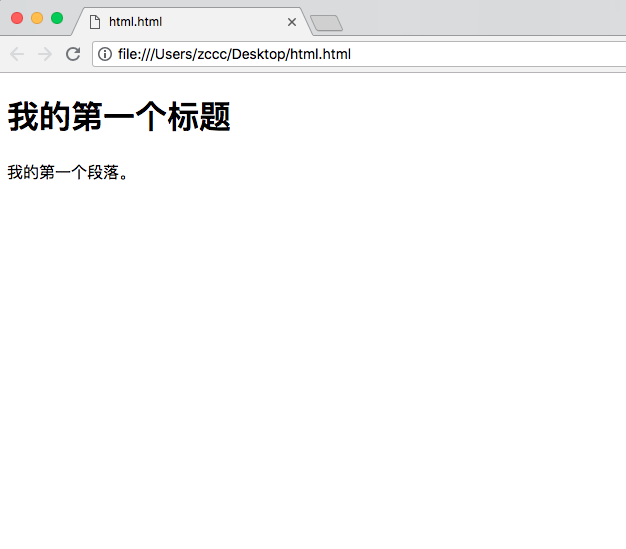

# 基本的 HTML 标签 - 四个实例

---

## 本节通过实例演示最常用的 HTML 标签。

---

### HTML 标题

HTML 标题（Heading）是通过 &lt;h1&gt; - &lt;h6&gt; 等标签进行定义的。

实例

```
<h1>this is a heading</h1>
<h2>this is a heading</h2>
<h3>this is a heading</h3>
```

---

### HTML 段落

HTML 段落是通过 &lt;p&gt; 标签进行定义的。

实例

```
<p>this is a paragraph.</p>
<p>this is another paragraph.</p>
```

### HTML 链接

HTML 链接是通过 &lt;a&gt; 标签进行定义的。

实例

```
<a href="https://www.baidu.com">百度</a>
```

注释：在 href 属性中指定链接的地址。

---

### HTML 图像

HTML 图像是通过 &lt;img&gt; 标签进行定义的。

实例

```

```

注释：图像的名称和尺寸是以属性的形式提供的。

