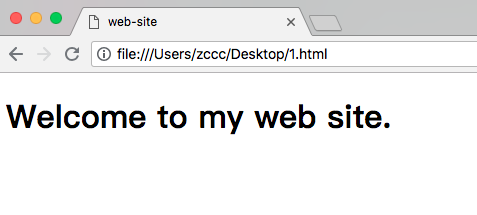

# HTML 头部元素

---

### HTML &lt;head&gt; 元素

&lt;head&gt; 元素是所有头部元素的容器。&lt;head&gt; 内的元素可包含脚本，指示浏览器在何处可以找到样式表，提供元信息，等等。

以下标签都可以添加到 head 部分：

* &lt;title&gt;
* &lt;base&gt;
* &lt;link&gt;
* &lt;meta&gt;
* &lt;script&gt;
* &lt;style&gt;

注释：其实 head 部分的思想非常类似于移动端、服务端开发中的配置文件的思想。

注释：我们可以活学活用这个思想，在移动端开发中也封装出 UI样式，交互处理，业务处理的配置文件。

---

### HTML &lt;title&gt; 元素

&lt;title&gt; 标签定义文档的标题。

title 元素在所有 HTML/XHTML 文档中都是必需的。

title 元素能够：

* 定义浏览器工具栏中的标题
* 提供页面被添加到收藏夹时显示的标题
* 显示在搜索引擎结果中的页面标题

一个简化的 HTML 文档：

```
<!DOCTYPE html>
<html>
<head>
    <title>web-site</title>
</head>
<body>
    <h1>Welcome to my web site.</h1>
</body>
</html>
```

效果：



---

### HMTL &lt;base&gt; 元素

&lt;base&gt; 元素为页面上的所有链接规定默认地址或默认目标（target）：

```
<!DOCTYPE html>
<html>
<head>
    <base href="https://www.hao123.com/" />
    <base target="_blank" />
</head>
<body>
    <h1>Welcome to my web site.</h1><br />
    <a href="">jump</a>
</body>
</html>
```

注释：因为设置了 &lt;base&gt; 标签的 href 属性值为 'https://www.hao123.com'，即使 &lt;a&gt; 标签没有设置 href 属性，也可以跳转至 'https://www.hao123.com'。

注释：因为设置了 &lt;base&gt; 标签的 target 属性值为 '_blank'，即使 &lt;a&gt; 标签没有设置 target 属性，也依然会在新窗口中打开链接。

---

### HTML &lt;link&gt; 元素

&lt;link&gt; 标签定义文档与外部资源之间的关系。

&lt;link&gt; 标签最常用于链接样式表。

```
<head>
    <link rel="stylesheet" type="text/css" href="mystyle.css" />
</head>
```

---

### HTML &lt;style&gt; 元素

&lt;style&gt; 标签用于为文档定义样式信息。

您可以在 style 元素内规定 HTML 元素在浏览器中呈现的样式。

```
<head>
    <style type="text/css">
        body {background-color:yellow}
        p {color:blue}
    </style>
</head>
```

---

### HTML &lt;meta&gt; 元素

元数据（metadata）是关于数据的信息。

&lt;meta&gt; 标签提供关于 HTML 文档的元数据。元数据不会显示在页面上，但是对于机器是可读的。

典型的情况是，meta 元素被用于规定页面的描述、关键词、文档的作者、最后修改时间以及其他元数据。

&ltmeta&gt; 标签始终位于 head 元素中。

元数据可用于浏览器（如何显示内容或重新加载页面），搜索引擎（关键词），或其他 web 服务。

### 针对搜索引擎的关键词

一些搜索引擎会利用 meta 元素的 name 和 content 属性来索引您的页面。

下面的 meta 元素定义页面的描述：

```
<meta name="description" content="Free Web tutorials on HTML, CSS, XML" />
```

下面的 meta 元素定义页面的关键词:


```
<meta name="keywords" content="HTML, CSS, XML" />
```

注释：name 和 content 属性的作用是描述页面的内容。

---

### HTML 头部元素

| 标签 | 描述
|------|-----
| &lt;head&gt; | 定义关于文档的信息
| &lt;title&gt; | 定义文档标题
| &lt;base&gt; | 定义页面上所有链接的默认地址或默认目标
| &lt;link&gt; | 定义文档与外部资源之间的关系
| &lt;meta&gt; | 定义 HTML 文档的元数据
| &lt;style&gt; | 定义文档的样式信息
| &lt;script&gt; | 定义客户端脚本


