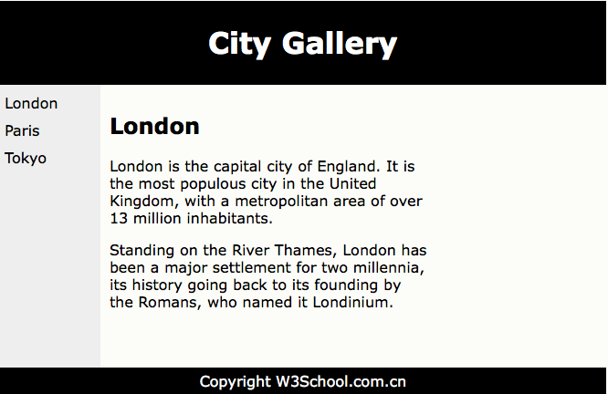

# HTML 布局

---

网站通常以多列显示内容，就像报纸一般。



---

### 使用 &lt;div&gt; 元素的 HTML 布局

&lt;div&gt; 元素常用作布局工具，因为能够轻松的通过 CSS 对其进行定位。

上面的例子使用 4 个 &lt;div&gt; 元素进行多列布局：

```
<!DOCTYPE html>
<html>
<head>
	<title>web-site</title>
	<style>
	#header {
    	background-color:black;
    	color:white;
    	text-align:center;
    	padding:5px;
	}
	#nav {
    	line-height:30px;
    	background-color:#eeeeee;
    	height:300px;
    	width:100px;
    	float:left;
   	 	padding:5px; 
	}
	#section {
    	width:350px;
    	float:left;
    	padding:10px; 
	}
	#footer {
    	background-color:black;
    	color:white;
    	clear:both;
    	text-align:center;
    	padding:5px; 
	}
	</style>
</head>
<body>

	<div id="header">
		<h1>City Gallery</h1>
	</div>

	<div id="nav">
		London<br>
		Paris<br>
		Tokyo<br>
	</div>

	<div id="section">
		<h1>London</h1>
		<p>
		London is the capital city of England. It is the most populous city in the United Kingdom,
		with a metropolitan area of over 13 million inhabitants.
		</p>
		<p>
		Standing on the River Thames, London has been a major settlement for two millennia, its history going back to its founding by the Romans, who named it Londinium.
		</p>
	</div>

	<div id="footer">
		Copyright W3School.com.cn
	</div>

</body>
</html>
```

---

### 使用 HTML5 的网站布局

HTML5 提供的新语义定义了网页的不同部分：

#### HTML5 语义元素

| 标签 | 描述
|--------|-------------------
| header | 定义文档或节的页眉
| nav | 定义导航链接的容器
| section | 定义文档中的节
| article | 定义独立的自包含文章
| aside | 定义内容之外的内容（比如侧栏）
| footer | 定义文档或节的页脚
| details | 定义额外的细节
| summary | 定义 details 元素的标题

这个例子使用 &lt;header&gt;, &lt;nav&gt;, &lt;section&gt;, 以及 &lt;footer&gt; 来创建多列布局：

```
<!DOCTYPE html>
<html>
<head>
	<title>web-site</title>
	<style>
	header {
    	background-color:black;
    	color:white;
    	text-align:center;
    	padding:5px;
	}
	nav {
    	line-height:30px;
    	background-color:#eeeeee;
    	height:300px;
    	width:100px;
    	float:left;
   	 	padding:5px; 
	}
	section {
    	width:350px;
    	float:left;
    	padding:10px; 
	}
	footer {
    	background-color:black;
    	color:white;
    	clear:both;
    	text-align:center;
    	padding:5px; 
	}
	</style>
</head>
<body>

	<header>
		<h1>City Gallery</h1>
	</header>

	<nav>
		London<br>
		Paris<br>
		Tokyo<br>
	</nav>

	<section>
		<h1>London</h1>
		<p>
		London is the capital city of England. It is the most populous city in the United Kingdom,
		with a metropolitan area of over 13 million inhabitants.
		</p>
		<p>
		Standing on the River Thames, London has been a major settlement for two millennia, its history going back to its founding by the Romans, who named it Londinium.
		</p>
	</sectio>

	<footer>
		Copyright W3School.com.cn
	</footer>

</body>
</html>
```

---
