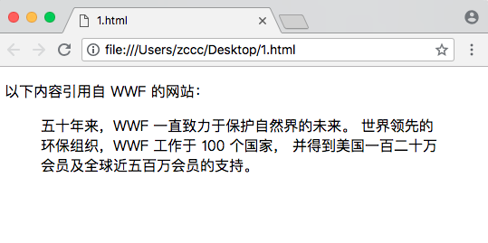

# HTML 引用

---

### 引用（Quotation）

---

### HTML &lt;q&gt; 用于短引用

实例：

```
<p>WWF的目标是：<q>构建人与自然和谐共处的世界</q></p>
```

注释：浏览器通常会为 &lt;q&gt; 元素包围引号

---

### HTML &lt;blockquote&gt; 用于长引用

实例：

```
<p>以下内容引用自 WWF 的网站：</p>
<blockquote cite="http://www.worldwildlife.org/who/index.html">
五十年来，WWF 一直致力于保护自然界的未来。
世界领先的环保组织，WWF 工作于 100 个国家，
并得到美国一百二十万会员及全球近五百万会员的支持。
</blockquote>
```

结果



注释：浏览器通常会为 &lt;blockquote&gt; 进行缩进处理。

---

### HTML &lt;abbr&gt; 用于缩略词

HTML &lt;abbr&gt; 定义缩写或首字母缩略语。

实例：

```
<p><abbr title="World Healte Organization">WHO</abbr>成立于1948年。</p>
```

注释：对缩写进行标记能够为浏览器、翻译系统以及搜索引擎提供有用的信息。

---

### HTML &lt;address&gt; 用于联系信息

HTML &lt;address&gt; 元素定义文档或文章的联系信息（作者/拥有者）

实例：

```
<address>
Written by zccc.<br />
Visit us at:<br />
Example.com<br />
Box 564, Street<br />
USA
</address>
```

---

### HTML &LT;cite&gt; 用于著作标题

HTML &lt;cite&gt; 元素定义著作标题。

浏览器通常会以斜体显示 &lt;cite&gt; 元素。

实例：

```
<p><cite>The Scream</cite> by Edward Munch. Painted in 1893.</p>
```

---

### HTML &lt;bdo&gt; 用于双向重写

HTML &lt;bdo&gt; 元素定义双流向覆盖。

&lt;bdo&gt; 元素用于覆盖当前文本方向。

实例：

```
<bdo dir="rtl">This text will be written from right to left</bdo>
```


