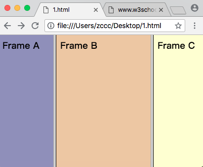
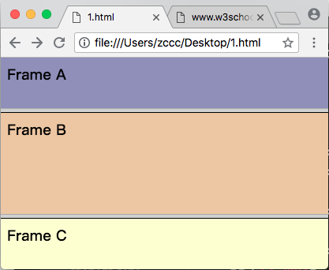
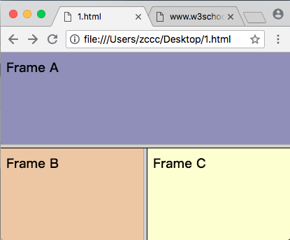
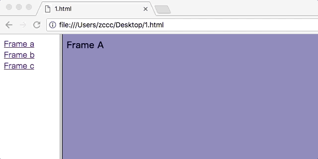
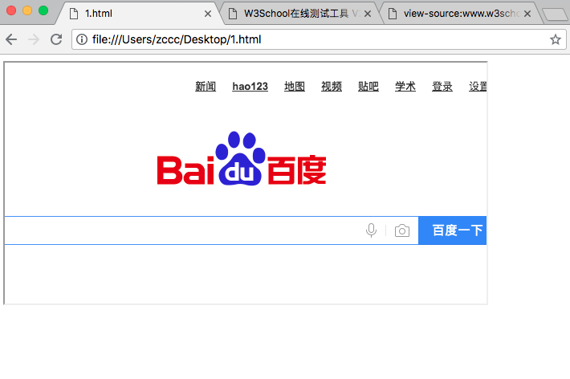
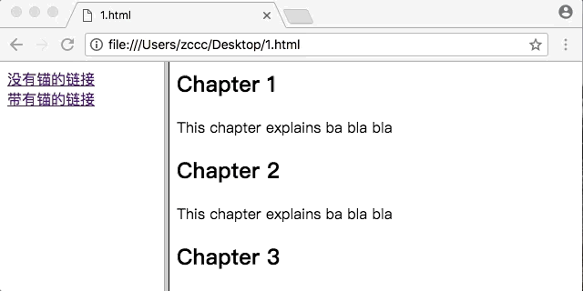

# HTML 框架

---

### 通过使用框架，你可以在同一个浏览器窗口中显示不止一个页面。

---

框架结构标签 &lt;frameset&gt; 

* 框架结构标签 &lt;frameset&gt; 定义如何将窗口分割为框架
* 每个 frameset 定义一系列行或者列
* rows / cols 的值规定了每行或每列占据屏幕的面积

语法：

```
<frameset rows="percent, percent">
    <frame src="HTML路径">
    <frame src="HTML路径">
</frameset>
```
 
---

## 实例

### 垂直框架

本例展示如何使用三份不同文档制作一个垂直框架。

```
<!DOCTYPE html>
<html>
<head>
  <title></title>
</head>
<frameset cols="25%, 50%, 25%">
    <frame src="http://www.w3school.com.cn/example/html/frame_a.html"></frame>    
    <frame src="http://www.w3school.com.cn/example/html/frame_b.html"></frame>   
    <frame src="http://www.w3school.com.cn/example/html/frame_c.html"></frame>   
</frameset>
</html>
```

效果：



### 水平框架

本例展示如何使用三份不同文档制作一个水平框架。

```
<!DOCTYPE html>
<html>
<head>
  <title></title>
</head>
<frameset rows="25%, 50%, 25%">
    <frame src="http://www.w3school.com.cn/example/html/frame_a.html"></frame>    
    <frame src="http://www.w3school.com.cn/example/html/frame_b.html"></frame>   
    <frame src="http://www.w3school.com.cn/example/html/frame_c.html"></frame>   
</frameset>
</html>
```

效果：



---

### 如何使用 &lt;noframes&gt; 标签

```
<!DOCTYPE html>
<html>
<head>
  <title></title>
</head>
<frameset rows="25%, 50%, 25%">
    <frame src="http://www.w3school.com.cn/example/html/frame_a.html"></frame>    
    <frame src="http://www.w3school.com.cn/example/html/frame_b.html"></frame>   
    <frame src="http://www.w3school.com.cn/example/html/frame_c.html"></frame>   
    <noframes>
        <body>
        您的浏览器不支持框架。
        </body>
    </noframes>
</frameset>
</html>
```

注释: &lt;frameset&gt; 标签不能与 &lt;body&gt; 标签同时存在。

注释：有的浏览器不支持 &lt;frameset&gt; 标签，所以无法正常渲染文档。我们需要单独添加 &lt;noframes&gt; 标签提示用户。

---

### 内联框架

本例展示如何创建内联框架（HTML 页中的框架）。


### 混合框架结构

本例展示如何使用三份文档，将它们混合置于行和列之中。

```
<!DOCTYPE html>
<html>
<head>
  <title></title>
</head>
<frameset rows="50%, 50%">
    <frame src="http://www.w3school.com.cn/example/html/frame_a.html"></frame>
    <frameset cols="50%, 50%">
        <frame src="http://www.w3school.com.cn/example/html/frame_b.html"></frame>
        <frame src="http://www.w3school.com.cn/example/html/frame_c.html"></frame>
    </frameset>
</frameset>
</html>
```



---

### 含有 noresize="noresize" 属性的框架结构

本例展示 noresize 属性的使用。

默认情况下，可以通过拖拽框架的边框来改变框架的尺寸。使用 noresize 属性禁止框架拖拽。

```
<!DOCTYPE html>
<html>
<head>
  <title></title>
</head>
<frameset rows="25%, 50%, 25%">
    <frame src="http://www.w3school.com.cn/example/html/frame_a.html" noresize="noresize"></frame>    
    <frame src="http://www.w3school.com.cn/example/html/frame_b.html" noresize="noresize"></frame>   
    <frame src="http://www.w3school.com.cn/example/html/frame_c.html" noresize="noresize"></frame>   
</frameset>
</html>
```

---

### 导航框架

本例展示如何制作导航框架。导航框架包含一个将第二个框架作为目标的框架列表。

```
<!DOCTYPE html>
<html>
<head>
  <title></title>
</head>
<frameset cols="120, *">
    <frame src="http://www.w3school.com.cn/example/html/html_contents.html"></frame>
    <frame src="http://www.w3school.com.cn/example/html/frame_a.html" name="showframe"></frame>
</frameset>
</html>
```

效果：



注释：

* 120 代表固定的 120 宽度，* 代表屏幕剩余宽度
* 给目标框架命名锚点为 showframe，在导航框架文档链接中的 target 属性设为 showframe，即可在目标框架中跳转。

---

### 内联框架

本例展示如何创建内联框架。

```
<!DOCTYPE html>
<html>
<head>
  <title></title>
</head>
<body>
    <iframe src="https://www.baidu.com" width="600" height="300"></iframe>
</body>
</html>
```

效果：



---

### 使用导航框架跳转至指定的节

本例展示两个框架，左侧导航框架包含一个链接列表，这些链接将第二个框架作为目标。第二个框架显示被链接的文档，导航框架其中的链接指向目标框架中的节。

```
<!DOCTYPE html>
<html>
<head>
  <title></title>
</head>
<frameset cols="180, *">
    <frame src="http://www.w3school.com.cn/example/html/content.html"></frame>
    <frame src="http://www.w3school.com.cn/example/html/link.html" name="showframe"></frame>
</frameset>
</html>
```

效果：



注释：目标框架命名锚点 showframe，导航框架内链接的 target 属性设为 showframe，即可实现在目标框架中跳转。

注释：目标框架中的 &lt;h1&gt; 元素命名 C1 - C10 的锚点，导航框架内链接的 href 属性设为 example/html/link.html#C10，即可实现跳转目标框架中的不同节点。

注释：此例充分运用了框架与超链接锚点的知识。

---

