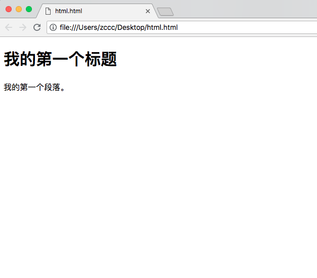

# HTML 编辑器

---

### 使用 Notepad 或 TextEdit 来编写 HTML

可以使用专业的 HTML 表机器来编辑 HTML：

* Vim
* Sublime Text
* VSCode

本人主要使用以上三款编辑器来学习 HTML

通过 Sublime 来创建我的第一张网页。

---

### 步骤一：启动 Sublime

```
open /Applications/Sublime Text.app
```

---

### 步骤二：编辑 HTML

在 Sublime 中键入 HTML 代码：

```
<!DOCTYPE HTML>
<html>
<body>

<h1>我的第一个标题</h1>

<p>我的第一个段落。</p>

</body>
</html>
```

---

### 步骤三：保存 HTML

使用快捷键 cmd + s 保存文档

当保存 HTML 文档时，即可以使用 .htm 也可以使用 .html 扩展名，两者没有区别。

---

### 步骤四：在浏览器中运行这个 HTML 文件

结果应该类似这样：


