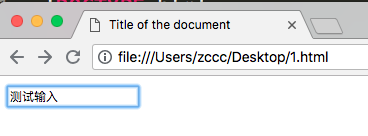
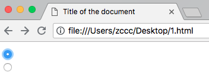
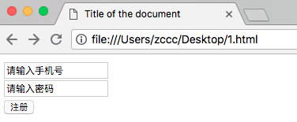
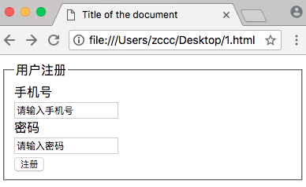

# HTML 表单

---

### HTML 表单用于收集不同类型的用户输入

---

### &lt;form&gt; 元素

&lt;form&gt; 元素定义 HTML 表单。

语法：

```
<form>
    form elements
</form>
```

---

### HTML 表单包含表单元素

表单元素指的是不同类型的 input 元素、复选框、单选按钮、提交按钮等等。

---

### &lt;input&gt; 元素

&lt;input&gt; 元素是最重要的表单元素。

&lt;input&gt; 元素有很多形态，根据不同的 type 属性。

这是文档中使用的类型：

| 类型 | 描述
|------|-----
| text | 定义常规文本输入
| radio | 定义单选按钮输入
| submit | 定义提交按钮（提交表单）

---

### 文本输入

&lt;input type="text"&gt; 定义用于文本输入的单行输入字段：

实例：

```
<!DOCTYPE html>
<html>
<head>
    <title>
        Title of the document
    </title>
</head>
<body>
    <form>
        <input type="text" name="name_field" />
    </form>
</body>
</html>
```

效果：



注释：value 属性值代表了输入框中的文本

---

### 单选按钮输入

&lt;input type="radio"&gt; 定义单选按钮。

实例：

```
<!DOCTYPE html>
<html>
<head>
    <title>
        Title of the document
    </title>
</head>
<body>
    <form>
        <input type="radio" name="sex_field" value="male" checked="checked" />
        <br />
        <input type="radio" name="sex_field" value="female" />
    </form>
</body>
</html>
```

效果：



注释：

* 两个单选框的 name 属性必须一致，代表着它们一起组成了一个单选框组织
* 单选框的 value 属性代表着这个单选框代表的值
* 单选框的 checked 属性代表着默认选中状态

---

### 提交按钮

&lt;input type="submit"&gt; 定义用于向表单处理程序提交表单的按钮。

表单处理程序在表单的 action 属性中指定。

实例：

```
<!DOCTYPE html>
<html>
<head>
    <title>
        Title of the document
    </title>
</head>
<body>
    <form action="register.python">
        <input type="text" name="phone_field" value="请输入手机号" />
        <br />
        <input type="text" name="pwd_field" value="请输入密码" />
        <br />
        <input type="submit" name="reg_button" value="注册" />
    </form>
</body>
</html>
```

效果：



注释：value 属性值代表了按钮上的文本

---

### Action 属性

action 属性定义在提交表单时执行的动作。

向服务器提交表单的通常做法是使用提交按钮。

通常，表单会被提交到 web 服务器上。

在上面的例子中，指定了某个服务器脚本来处理被提交的表单：

```
<form action="register.python">
```

如果省略 action 属性，则 action 会被设置为当前页面。

---

### Method 属性

method 属性规定在提交表单时所用的 HTTP 方法（GET 或 POST）：

```
<form action="register.python" method="GET">
```

或者：

```
<form action="register.python" method="POST">
```

---

### 何时使用 GET？

您能够使用 GET（默认方法）：

如果表单提交是被动的（比如搜索引擎查询），并且没有敏感信息。

当您使用 GET 时，表单数据在页面地址栏中是可见的：

```
register.python?phone_field=zccc&pwd_field=111111
```

注释：GET 最适合少量数据的提交，浏览器会设定容量限制。

---

### 何时使用 POST？

您应该使用 POST：

如果表单正在更新数据，或者包含敏感信息（例如密码）。

POST 的安全性更加，因为在页面地址栏中被提交的数据是不可见的。

---

### Name 属性

如果要正确的被提交，每个输入字段必须设置一个 name 属性。

本例只会提交 "phone_field" 输入字段：

```
<!DOCTYPE html>
<html>
<head>
    <title>
        Title of the document
    </title>
</head>
<body>
    <form action="register.python">
        <input type="text" name="phone_field" value="请输入手机号" />
        <br />
        <input type="text" value="请输入密码" />
        <br />
        <input type="submit" name="reg_button" value="注册" />
    </form>
</body>
</html>
```

### 用 &lt;fieldset&gt; 组合表单数据

&lt;fieldset&gt; 元素组合表单中的相关数据

&lt;legend&gt; 元素为 &lt;field&gt; 元素定义标题

实例：

```
<!DOCTYPE html>
<html>
<head>
    <title>
        Title of the document
    </title>
</head>
<body>
    <form action="register.python" method="POST">
        <fieldset>
            <legend>用户注册</legend>
            手机号
            <br />
            <input type="text" name="phone_field" value="请输入手机号" />
            <br />
            密码
            <br />
            <input type="text" name="pwd_field" value="请输入密码" />
            <br />
            <input type="submit" name="reg_button" value="注册" />
        </fieldset>
    </form>
</body>
</html>
```

效果：



---

### HTML Form 属性

HTML &lt;form&gt; 元素，已设置所有可能的属性，是这样的：

```
<form action="register.python" method="GET" target="_blank" accept-charset="UTF-8"
ectype="application/x-www-form-urlencoded" autocomplete="off" novalidate>
    form elements
</form> 
```

下面是 form 属性列表：

| 属性 | 描述
|------|------
| accept-charset | 规定在被提交表单中使用的字符集
| action | 规定向何处提交表单的地址
| autocomplete | 规定浏览器应该自动完成表单（默认：开启）
| enctype | 规定被提交数据的编码（默认：url-encoded）
| method | 规定在被提交表单时所用的 HTTP 方法（more：GET）
| name | 规定识别表单的名称（对于 DOM 使用：document.forms.name）
| novalidate | 规定浏览器不验证表单
| target | 规定 action 属性中地址的目标（默认：_self）

---
