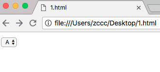
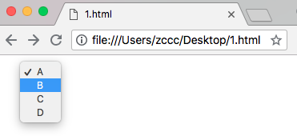
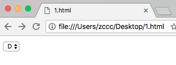
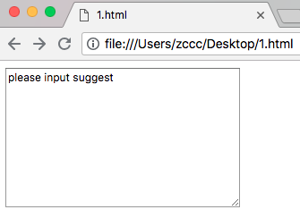
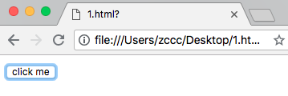
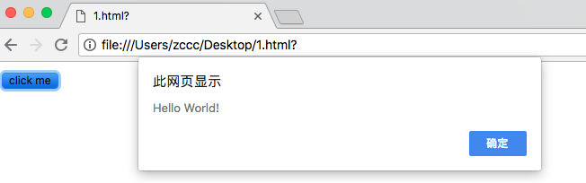

# HTML 表单元素

---

### 本节描述所有 HTML 表单元素

---

### &lt;input&gt; 元素

最重要的表单元素是 &lt;input&gt;元素。

&lt;input&gt; 元素根据不同的 type 属性，可以变化为多种形态。

---

### &lt;select&gt; 元素（下拉列表）

&lt;select&gt; 元素定义下拉列表：

实例：

```
<!DOCTYPE html>
<html>
<head>
    <title>
    </title>
</head>
<body>
    <form>
        <select>
            <option value="A">A</option>
            <option value="B">B</option>
            <option value="C">C</option>
            <option value="D">D</option>
        </select>
    </form>
</body>
</html>
```

效果：




注释：

* 列表通常会把首个选项显示为被选选项
* 可以通过 selected 属性来定义预定义选项

实例：

```
<!DOCTYPE html>
<html>
<head>
    <title>
    </title>
</head>
<body>
    <form>
        <select>
            <option value="A">A</option>
            <option value="B">B</option>
            <option value="C">C</option>
            <option value="D" selected="selected">D</option>
        </select>
    </form>
</body>
</html>
```

效果：



---


注释：

* option 元素的内容就是显示在浏览器中的选项
* option 元素的 value 属性代表真实的选项值

---

### &lt;textarea&gt; 元素

&lt;textarea&gt; 元素定义多行输入字段（文本域）。

实例：

```
<!DOCTYPE html>
<html>
<head>
    <title>
    </title>
</head>
<body>
    <form>
        <textarea name="suggest" cols="40" rows="10">please input suggest</textarea>
    </form>
</body>
</html>
```

效果：



注释：

* rows、cols 属性定义了文本域的文本行数、列数
* &lt;textarea&gt; 标签的内容就是文本域的占位文本

---

### &lt;button&gt; 元素

&lt;button&gt; 元素定义可点击的按钮

实例：

```
<!DOCTYPE html>
<html>
<head>
    <title>
    </title>
</head>
<body>
    <form>
        <button type="button" onclick="alert('Hello World!')">click me</button>
    </form>
</body>
</html>
```

效果：




注释：

* button 元素的内容就是按钮上的文本
* onclick 属性用来添加点击事件后执行的操作

---

### HTML5 表单元素

HTML5 增加了如下表单元素：

* &lt;detalist&gt;
* &lt;keygen&gt;
* &lt;output&gt;

注释：默认情况下，浏览器不会显示位置元素。新元素不会破坏您的页面。

---
