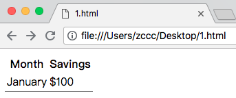

# HTML 表格

---

### 表格

表格由 &lt;table&gt; 标签来定义。每个表格均有若干行（由 &lt;tr&gt; 标签定义），每行被分割为若干单元格（由 &lt;td&gt; 标签定义）。字母 td 指表格数据（table data），即数据单元格的内容。数据单元格可以包含文本、图片、列表、段落、表单、水平线、表格等等。

--- 

### 表格的边框

本例展示表格的边框使用。

没有边框：

```
<table>
<tr>
<td>100</td>
<td>200</td>
<td>300</td>
</tr>
<tr>
<td>400</td>
<td>500</td>
<td>600</td>
</tr>
</table>
```

或者

```
<table border="0">
<tr>
<td>100</td>
<td>200</td>
<td>300</td>
</tr>
<tr>
<td>400</td>
<td>500</td>
<td>600</td>
</tr>
</table>
```

效果：


边框宽度为 5 的表格：


```
<table border="5">
<tr>
<td>100</td>
<td>200</td>
<td>300</td>
</tr>
<tr>
<td>400</td>
<td>500</td>
<td>600</td>
</tr>
</table>
```

效果：


---

### 表格的表头

本例演示如何显示表格表头。

大多数浏览器会把表头显示为粗体居中的文本。

水平的表头：

```
<table border="1">
	<tr>
		<th>姓名</th>
		<th>电话</th>
		<th>电话</th>
	</tr>
	<tr>
		<td>Bill Gates</td>
		<td>555 77 854</td>
		<td>555 77 854</td>
	</tr>
</table>
```

垂直的表头：

```
<table border="1">
	<tr>
		<th>姓名</th>
		<td>Bill Gates</td>
	</tr>
	<tr>
		<th>电话</th>
		<td>555 77 854</td>
	</tr>
	<tr>
		<th>电话</th>
		<td>555 77 854</td>
	</tr>
</table>
```

效果：


---

### 空单元格

本例演示如何使用 "\&nbsp;" 处理没有内容的单元格。

```
<table border="1">
	<tr>
  		<td>Some text</td>
  		<td>Some text</td>
	</tr>
	<tr>
  		<td>&nbsp;</td>
  		<td>Some text</td>
	</tr>
</table>
```

注释：为了避免空单元格造成的不显示边框的现象，统一向空单元格中键入 \&nbsp;（空格）。

效果：


---

### 带有标题的表格

本例展示一个带标题（caption）的表格。

```
<table border="6">
	<caption>我的标题</caption>
	<tr>
  		<td>100</td>
  		<td>200</td>
  		<td>300</td>
	</tr>
	<tr>
  		<td>400</td>
  		<td>500</td>
  		<td>600</td>
	</tr>
</table>
```

效果：


---

### 跨行或跨列的表格单元格

本例展示如何定义跨行或跨列的表格单元格。

跨列：

```
<table border="1">
	<tr>
		<th>姓名</th>
		<th colspan="2">电话</th>
	</tr>
	<tr>
		<td>Bill Gates</td>
		<td>555 77 854</td>
		<td>555 77 854</td>
	</tr>
</table>
```

效果：


跨行：

```
<table border="1">
	<tr>
		<th>姓名</th>
		<td>Bill Gates</td>
	</tr>
	<tr>
		<th rowspan="2">电话</th>
		<td>555 77 854</td>
	</tr>
	<tr>
		<td>555 77 854</td>
	</tr>
</table>
```

效果：


---

### 表格内的标签

本例展示如何在单元格内显示不同元素。

```
<table border="1">
	<tr>
		<td>
			<p>this is a paragraph</p>
			<p>this is another</p>
		</td>
		<td>
			这个表格内包含一个表格
			<table border="1">
				<tr>
					<td>A</td>
					<td>B</td>
				</tr>
				<tr>
					<td>C</td>
					<td>D</td>
				</tr>
			</table>
		</td>
	</tr>
	<tr>
		<td>
			这个表格内包含一个列表
			<ul>
				<li>苹果</li>
				<li>香蕉</li>
				<li>西瓜</li>
			</ul>
		</td>
		<td>Hello World</td>
	</tr>
</table>
```

效果：


---

### 单元格边距（Cell padding）

本例展示如何使用 Cell padding 属性来创建单元格内容与边框之间的边距。

没有边距：

```
<table border="1">
	<tr>
		<td>A</td>
		<td>B</td>
	</tr>
	<tr>
		<td>C</td>
		<td>D</td>
	</tr>
</table>
```

效果：


边距为 20 ：

```
<table border="1" cellpadding="20">
	<tr>
		<td>A</td>
		<td>B</td>
	</tr>
	<tr>
		<td>C</td>
		<td>D</td>
	</tr>
</table>
```

效果：


---

### 单元格间距（Cell spacing）

本例展示如何使用 Cell spacing 增加单元格之间的距离。

没有间距：

```
<table border="20">
	<tr>
		<td>A</td>
		<td>B</td>
	</tr>
	<tr>
		<td>C</td>
		<td>D</td>
	</tr>
</table>
```

效果：


间距为 20 ：

```
<table border="20" cellspacing="20">
	<tr>
		<td>A</td>
		<td>B</td>
	</tr>
	<tr>
		<td>C</td>
		<td>D</td>
	</tr>
</table>
```

效果：


---

### 向表格添加背景颜色或背景图片

本例演示如何向表格添加背景。

添加背景颜色：

```
<table border="1" bgcolor="yellow">
	<tr>
		<td>A</td>
		<td>B</td>
	</tr>
	<tr>
		<td>C</td>
		<td>D</td>
	</tr>
</table>
```

或者

```
<table border="1" style="background-color: yellow">
	<tr>
		<td>A</td>
		<td>B</td>
	</tr>
	<tr>
		<td>C</td>
		<td>D</td>
	</tr>
</table>
```

效果：


---

### 在单元格中排列内容

本例展示如何使用 align 属性排列单元格内容，以便创建一个美观的表格

```
<table width="400" border="1">
	<tr>
  		<th align="left">消费项目....</th>
  		<th align="right">一月</th>
  		<th align="right">二月</th>
 	</tr>
 	<tr>
  		<td align="left">衣服</td>
  		<td align="right">$241.10</td>
  		<td align="right">$50.20</td>
	</tr>
 	<tr>
  		<td align="left">化妆品</td>
  		<td align="right">$30.00</td>
  		<td align="right">$44.45</td>
 	</tr>
 	<tr>
  		<td align="left">食物</td>
  		<td align="right">$730.40</td>
  		<td align="right">$650.00</td>
	</tr>
 	<tr>
  		<th align="left">总计</th>
  		<th align="right">$1001.50</th>
  		<th align="right">$744.65</th>
 	</tr>
</table>
```

或者

```
<table width="400" border="1">
	<tr>
  		<th style="text-align: left">消费项目....</th>
  		<th style="text-align: right">一月</th>
  		<th style="text-align: right">二月</th>
 	</tr>
 	<tr>
  		<td style="text-align: left">衣服</td>
  		<td style="text-align: right">$241.10</td>
  		<td style="text-align: right">$50.20</td>
	</tr>
 	<tr>
  		<td style="text-align: left">化妆品</td>
  		<td style="text-align: right">$30.00</td>
  		<td style="text-align: right">$44.45</td>
 	</tr>
 	<tr>
  		<td style="text-align: left">食物</td>
  		<td style="text-align: right">$730.40</td>
  		<td style="text-align: right">$650.00</td>
	</tr>
 	<tr>
  		<th style="text-align: left">总计</th>
  		<th style="text-align: right">$1001.50</th>
  		<th style="text-align: right">$744.65</th>
 	</tr>
</table>
```

效果：


---

### 框架（frame）属性

本例展示如何使用 frame 属性来控制围绕表格的边框。

box：

```
<table frame="box">
 	<tr>
    	<th>Month</th>
    	<th>Savings</th>
  	</tr>
  	<tr>
    	<td>January</td>
    	<td>$100</td>
  	</tr>
</table>
```

效果：


above：

```
<table frame="above">
 	<tr>
    	<th>Month</th>
    	<th>Savings</th>
  	</tr>
  	<tr>
    	<td>January</td>
    	<td>$100</td>
  	</tr>
</table>
```

效果：


below：

```
<table frame="below">
 	<tr>
    	<th>Month</th>
    	<th>Savings</th>
  	</tr>
  	<tr>
    	<td>January</td>
    	<td>$100</td>
  	</tr>
</table>
```

效果：



hsides：

```
<table frame="hsides">
 	<tr>
    	<th>Month</th>
    	<th>Savings</th>
  	</tr>
  	<tr>
    	<td>January</td>
    	<td>$100</td>
  	</tr>
</table>
```

效果：


vsides：

```
<table frame="vsides">
 	<tr>
    	<th>Month</th>
    	<th>Savings</th>
  	</tr>
  	<tr>
    	<td>January</td>
    	<td>$100</td>
  	</tr>
</table>
```

效果：


