# HTML Input 属性

---

### Value 属性

value 属性规定输入字段的初始值：

```
<!DOCTYPE html>
<html>
<head>
    <title>
    </title>
    <meta charset="utf-8">
</head>
<body>
    <form action="">
        First name:<br>
        <input type="text" name="firstname" value="John" />
        <br />
        Last name:<br />
        <input type="text" name="lastname" />
    </form> 
</body>
</html>
```

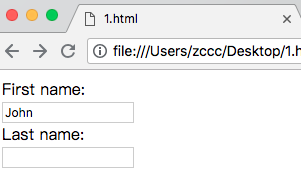

---

### readonly 属性

readonly 属性规定输入字段为只读


```
<!DOCTYPE html>
<html>
<head>
    <title>
    </title>
    <meta charset="utf-8">
</head>
<body>
    <form action="">
        First name:<br>
        <input type="text" name="firstname" value="John" readonly="readonly" />
        <br />
        Last name:<br />
        <input type="text" name="lastname" />
    </form> 
</body>
</html>
```

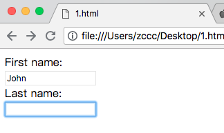

---

### disabled 属性

disabled 属性规定输入字段是禁用的

被禁用的元素是不可用和不可点击的

被禁用的元素不会被提交

```
<!DOCTYPE html>
<html>
<head>
    <title>
    </title>
    <meta charset="utf-8">
</head>
<body>
    <form action="">
        First name:<br>
        <input type="text" name="firstname" value="John" disabled="disabled" />
        <br />
        Last name:<br />
        <input type="text" name="lastname" />
    </form> 
</body>
</html>
```

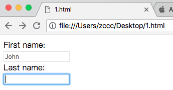

---

### size 属性

size 属性规定输入字段的尺寸（以字符计）

```
<!DOCTYPE html>
<html>
<head>
    <title>
    </title>
    <meta charset="utf-8">
</head>
<body>
    <form action="">
        First name:<br>
        <input type="text" name="firstname" value="John" size="40" />
        <br />
        Last name:<br />
        <input type="text" name="lastname" />
    </form> 
</body>
</html>
```

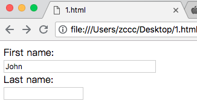

---

### maxlength 属性

maxlength 属性规定输入字段允许的最大长度

```
<!DOCTYPE html>
<html>
<head>
    <title>
    </title>
    <meta charset="utf-8">
</head>
<body>
    <form action="">
        First name:<br>
        <input type="text" name="firstname" value="John" maxlength="4" />
        <br />
        Last name:<br />
        <input type="text" name="lastname" />
    </form> 
</body>
</html>
```

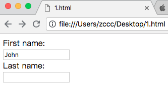

注释：该属性不会提示任何返回，如果需要提示用户，则必须编写 JS 脚本。

注释：输入限制并非决定有效，JS 提供了很多方法来突破这一限制。如需安全的限制输入，则需在服务端加以限制。

---

### HTML5 属性

HTML5 为 &lt;input&gt; 增加了如下属性：

* autocomplete 
* autofocus
* form
* formaction
* formmethod
* formnovalidate
* formtarget
* height 和 width
* list
* min 和 max
* multiple
* pattern
* placeholder
* required
* step

并为 &lt;form&gt; 增加如下属性：

* autocomplete
* novalidate

---

### autocomplete 属性

autocomplete 属性规定表单或输入字段是否应该自动完成。

当自动完成开启，浏览器会基于用户之前的输入值自动填写值。

提示：您可以把表单的 autocomplete 设置为 on，同时把特定的输入字段设置为 off，反之亦然。

autocomplete 属性适用于 &lt;for&gt; 以及如下 &lt;input&gt; 类型：text、search、url、tel、email、password、datepickers、range 以及 color。

---

### novalidate 属性

novalidate 属性属于 &lt;form&gt; 属性。

如果设置，则 novalidate 规定在提交表单时不对表单数据进行验证。

```
<!DOCTYPE html>
<html>
<head>
    <title>
    </title>
    <meta charset="utf-8">
</head>
<body>
    <form action="" autocomplete="on" novalidate="novalidate">
        <input type="email" name="email" />
    </form> 
</body>
</html>
```

---

### autofocus 属性

autofocus 属性是布尔属性。

如果设置，则规定当页面加载时 &lt;input&gt; 元素应该自动获得焦点。

```
<!DOCTYPE html>
<html>
<head>
    <title>
    </title>
    <meta charset="utf-8">
</head>
<body>
    <form>
        <input type="text" name="text" autofocus="autofocus" />
    </form> 
</body>
</html>
```

### form 属性

form 属性规定 &lt;input&gt; 元素所属的一个或多个表单。

提示：如需引用一个以上的表单，请使用空格分割的表单 id 列表。

```
<!DOCTYPE html>
<html>
<head>
    <title>
    </title>
    <meta charset="utf-8">
</head>
<body>
    <form action="action_page.php" id="form1">
        First name: <input type="text" name="fname" /><br />
        <input type="submit" value="Submit" />
    </form>
    Last name: <input type="text" name="lname" form="form1" />
</body>
</html>
```

---

### formaction 属性

formaction 属性规定当提交表单时处理该输入空间的文件的 URL。

formaction 属性覆盖 &lt;form&gt; 元素的 action 属性。

formaction 属性适用于 type="submit" 以及 type="image"。

```
<!DOCTYPE html>
<html>
<head>
    <title>
    </title>
    <meta charset="utf-8">
</head>
<body>
    <form action="action_page.php">
        First name: <input type="text" name="fname" /><br />
        Last name: <input type="text" name="lname" /><br />
        <input type="submit" value="Submit" /><br />
        <input type="submit" formaction="demo_admin.asp" value="Submit as admin" />
    </form> 
</body>
</html>
```

### formenctype 属性

formenctype 属性规定当把表单数据（form-data）提交至服务器时如何对其进行编码（仅针对 method="post" 的表单）。

formenctype 属性覆盖 &lt;form&gt; 元素的 enctype 属性。

formenctype 属性适用于 type="submit" 以及 type="image"。

发送默认编码以及编码为 "multipart/form-data"（第二个提交按钮）的表单数据（form-data）：

```
<!DOCTYPE html>
<html>
<head>
    <title>
    </title>
    <meta charset="utf-8">
</head>
<body>
    <form action="demo_post_enctype.asp" method="post">
        First name: <input type="text" name="fname" /><br />
        <input type="submit" value="Submit" />
        <input type="submit" formenctype="multipart/form-data"
   value="Submit as Multipart/form-data" />
    </form> 
</body>
</html>
```

---

### formmethod 属性

formmethod 属性定义用以向 action URL 发送表单数据的 HTTP 方法。

formmethod 属性覆盖 &lt;form&gt; 元素的 method 属性。

formmethod 属性适用于 type="submit" 以及 type="image"。

```
<!DOCTYPE html>
<html>
<head>
    <title>
    </title>
    <meta charset="utf-8">
</head>
<body>
    <form action="action_page.php" method="get">
        First name: <input type="text" name="fname" /><br />
        Last name: <input type="text" name="lname"><br />
        <input type="submit" value="Submit" />
        <input type="submit" formmethod="post" formaction="demo_post.asp"
   value="Submit using POST" />
    </form> 
</body>
</html>
```

---

### formnovalidate 属性

novalidate 属性是布尔属性。

如果设置，则规定在提交表单时不对 &lt;input&gt; 元素进行验证。

formnovalidate 属性覆盖 &lt;form&gt; 元素的 novalidate 属性。

formnovalidate 属性可用于 type="submit"。

```
<!DOCTYPE html>
<html>
<head>
    <title>
    </title>
    <meta charset="utf-8">
</head>
<body>
    <form>
        E-mail: <input type="email" name="userid" /><br />
        E-mail: <input type="email" name="userid" formnovalidate="formnovalidate" />
    </form> 
</body>
</html>
```

---

### formtarget 属性

formtarget 属性规定的名称或关键词指示提交表单后在何处显示接收到的响应。

formtarget 属性会覆盖 &lt;form&gt; 元素的 target 属性。

formtarget 属性可与 type="submit" 和 type="image" 使用。

```
<!DOCTYPE html>
<html>
<head>
    <title>
    </title>
    <meta charset="utf-8">
</head>
<body>
    <form action="action_page.php">
        First name: <input type="text" name="fname" /><br />
        Last name: <input type="text" name="lname" /><br />
        <input type="submit" value="Submit as normal" />
        <input type="submit" formtarget="_blank" value="Submit to a new window" />
    </form> 
</body>
</html>
```

---

### height 和 width 属性

height 和 width 属性规定 &lt;input&gt; 元素的高度和宽度。

height 和 width 属性仅用于 &lt;input type="image" /&gt; 。

注释：请始终规定图像的尺寸，如果浏览器不清楚图像的尺寸，则页面会在图像加载时闪烁。

```
<!DOCTYPE html>
<html>
<head>
    <title>
    </title>
    <meta charset="utf-8">
</head>
<body>
    <form action="action_page.php">
        <input type="image" src="https://www.baidu.com/img/bd_logo1.png" alt="Submit" width="500" height="500" />
    </form>
</body>
</html>
```

---

### list 属性

list 属性引用的 &lt;datalist&gt; 元素中包含了 &ltinput&gt; 元素的预定义选项。

使用 &lt;datalist&gt; 设置预定义值得 &lt;input&gt; 元素。

```
<!DOCTYPE html>
<html>
<head>
    <title>
    </title>
    <meta charset="utf-8">
</head>
<body>
    <form action="action_page.php">
        <input list="browsers" />
            <datalist id="browsers">
                <option value="Internet Explorer">
                <option value="Firefox">
                <option value="Chrome">
                <option value="Opera">
                <option value="Safari">
            </datalist> 
    </form> 
</body>
</html>
```

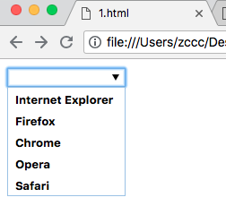

---

### min 和 max 属性

min 和 max 属性规定 &lt;input&gt; 元素的最小值和最大值。

min 和 max 属性适用于如需输入类型：number、range、date、datetime、datetime-local、month、time 以及 week。

```
<!DOCTYPE html>
<html>
<head>
    <title>
    </title>
    <meta charset="utf-8">
</head>
<body>
    <form action="action_page.php">
        Enter a date before 1980-01-01:
        <input type="date" name="bday" max="1979-12-31" />
        <br />
        Enter a date after 2000-01-01:
        <input type="date" name="bday" min="2000-01-02" />
        <br />
        Quantity (between 1 and 5):
        <input type="number" name="quantity" min="1" max="5" />
    </form> 
</body>
</html>
```

### multiple 属性

multiple 属性是布尔属性。

如果设置，则规定允许用户在 &lt;input&gt; 元素中输入一个以上的值。

multiple 属性适用于以下输入类型：email 和 file。

```
<!DOCTYPE html>
<html>
<head>
    <title>
    </title>
    <meta charset="utf-8">
</head>
<body>
    <form action="action_page.php">
        Select images: <input type="file" name="img" multiple="multiple" />
    </form> 
</body>
</html>
```

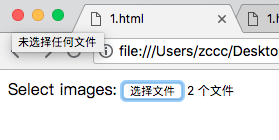

---

### pattern 属性

pattern 属性规定用于检查 &lt;input&gt; 元素值的正则表达式。

pattern 属性适用于以下输入类型：text、search、url、tel、email、and password。

```
<!DOCTYPE html>
<html>
<head>
    <title>
    </title>
    <meta charset="utf-8">
</head>
<body>
    <form action="action_page.php">
        Country code: 
        <input type="text" name="country_code" pattern="[A-Za-z]{3}" title="Three letter country code" />
    </form> 
</body>
</html>
```

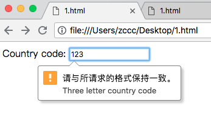

---

### placeholder 属性

placeholder 属性规定用以描述输入字段预期值的提示。

该提示会在用户输入之前显示在输入字段中。

placeholder 属性适用于以下输入类型：text、search、url、tel、email 以及 password。

```
<!DOCTYPE html>
<html>
<head>
    <title>
    </title>
    <meta charset="utf-8">
</head>
<body>
    <form action="action_page.php">
        <input type="text" name="fname" placeholder="First name" />
    </form> 
</body>
</html>
```

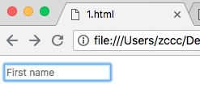

---

### required 属性

required 属性是布尔属性。

如果设置，则规定在提交表单之前必须填写输入字段。

required 属性适用于以下输入类型：text、search、url、tel、email、password、date pickers、number、checkbox、radio、and file。

```
<!DOCTYPE html>
<html>
<head>
    <title>
    </title>
    <meta charset="utf-8">
</head>
<body>
    <form action="action_page.php">
        Username: <input type="text" name="usrname" required="required" />
    </form> 
</body>
</html>
```

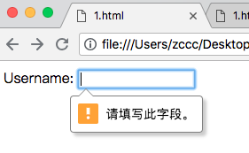

---

### step 属性

step 属性规定 &lt;input&gt; 元素的合法数字间隔。

提示：step 属性可与 max 以及 min 属性一同使用，来创建合法值得范围。

step 属性适用于以下输入类型：number、range、date、datetime、datetime-local、month、time 以及 week。

```
<!DOCTYPE html>
<html>
<head>
    <title>
    </title>
    <meta charset="utf-8">
</head>
<body>
    <form action="action_page.php">
        <input type="number" name="points" step="3" />
    </form> 
</body>
</html>
```

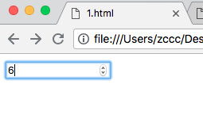

---
