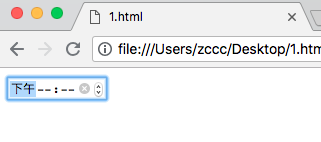

# HTML 输入类型

---

### 本节描述 input 元素的输入类型

---

### 输入类型：text

&lt;input type="text" /&gt; 定义文本输入的单行输入字段

实例：

```
<form>
    手机号:<br />
    <input type="text" name="phone">
    <br />
    密码:<br />
    <input type="text" name="password">
</form> 
```

效果：


---

### 输入类型：password

&lt;input type="password" /&gt; 定义密码字段

实例：

```
<form>
    手机号:<br />
    <input type="text" name="phone">
    <br />
    密码:<br />
    <input type="password" name="password">
</form> 
```

效果：


---

### 输入类型：submit

&lt;input type="submit" /&gt; 定义提交表单数据至服务器的按钮。

在表单的 action 属性中规定服务器 URL。

实例：

```
<form action="register.html">
    电话:<br />
    <input type="text" name="phone" value="请输入手机号">
    <br />
    密码:<br />
    <input type="password" name="password" value="请输入密码">
    <br /><br />
    <input type="submit" value="注册">
</form> 
```

效果：


---

### 输入类型：radio

&lt;input type="radio" /&gt; 定义单选按钮

实例：

```
<!DOCTYPE html>
<html>
<head>
    <title>
    </title>
</head>
<body>
    <form>
        <input type="radio" name="sex" value="male" checked="checked" /> 男
        <br />
        <input type="radio" name="sex" value="female" /> 女
    </form>
</body>
</html>
```

效果：


---

### 输入类型：checkbox

&lt;input type="checkbox" /&gt; 定义复选框

复选框允许用户在有限数量的选项中选择零个或多个选项

实例：


```
<form>
    <input type="checkbox" name="vehicle" value="Bike" />I have a bike
    <br />
    <input type="checkbox" name="vehicle" value="Car" />I have a car 
</form> 
```

效果：


---

### 输入类型：button

&lt;input type="button" /&gt; 定义按钮

实例：

```
<input type="button" onclick="alert('Hello World')" value="Click Me" />
```

效果：


---

### HTML5 输入类型

HTML5 增加了多个新的输入类型：

* color
* date
* datetime
* datetime-local
* email
* month
* number
* range
* search
* tel
* time
* url
* week

注释：老式 web 浏览器不支持的输入类型，会被视为 text 类型。

---

### 输入类型：number

&lt;input type="number" /&gt; 用于应该保护数字值得输入字段。

您能够对数字做出限制。

根据浏览器支持，限制可应用到输入字段。

实例：

```
<!DOCTYPE html>
<html>
<head>
    <title>
    </title>
</head>
<body>
    <form>
        Quantity（between 1 and 5）：
        <input type="number" name="quantity" min="1" max="5" />
    </form>
</body>
</html>
```


输入限制：

| 属性 | 描述
|------|-----
| disable | 规定输入字段应该被禁用
| max | 规定输入字段的最大值
| min | 规定输入字段的最小值
| maxlength | 规定输入字段的最大字符数
| pattern | 规定通过其检测输入值的正则表达式
| readonly | 规定输入字段为只读
| required | 规定输入字段是必需的
| size | 规定输入字段的宽度（以字符计）
| step | 规定输入字段的合法数字间隔
| value | 规定输入字段的默认值

---

### 输入类型：date

&lt;input type="date" /&gt; 用于应该保护日期的输入字段

根据浏览器支持，日期选择器会出现输入字段中

实例:

```
<!DOCTYPE html>
<html>
<head>
    <title>
    </title>
</head>
<body>
    <form>
        <input type="date" name="date" />
    </form>
</body>
</html>
```

效果：


也可以添加限制：

```
<!DOCTYPE html>
<html>
<head>
    <title>
    </title>
</head>
<body>
    <form>
        <input type="date" name="date" max="1979-12-31" />
        <input type="date" name="date" min="2001-12-31" />
    </form>
</body>
</html>
```

效果：


---

### 输入类型：color

&lt;input type="color"&gt; 用于包含颜色的输入字段

根据浏览器支持，颜色选择器会出现输入字段中

实例：

```
<!DOCTYPE html>
<html>
<head>
    <title>
    </title>
</head>
<body>
    <form>
        <input type="color" name="color" />
    </form>
</body>
</html>
```

效果：


---

### 输入类型：range

&lt;input type="range" /&gt; 用于包含一定范围内的值得输入字段

根据浏览器支持，输入字段能够显示为滑块空间。

实例：

```
<!DOCTYPE html>
<html>
<head>
    <title>
    </title>
</head>
<body>
    <form>
        <input type="range" name="range" min="0" max="100" />
    </form>
</body>
</html>
```

效果：


注释：能够使用 min、max、step、value 属性来限制。

---

### 输入类型：month

&lt;input type="month" /&gt; 允许用户选择月份和年份

根据浏览器支持，日期选择器会出现输入字段中

实例：

```
<!DOCTYPE html>
<html>
<head>
    <title>
    </title>
</head>
<body>
    <form>
        <input type="month" name="month" />
    </form>
</body>
</html>
```

效果：


---

### 输入类型：week

&lt;input type="week" /&gt; 允许用户选择周和年。

根据浏览器支持，日期选择器会出现在输入字段中。

```
<!DOCTYPE html>
<html>
<head>
    <title>
    </title>
</head>
<body>
    <form>
        <input type="week" name="week" />
    </form>
</body>
</html>
```

效果：


---

### 输入类型：time

&lt;input type="time" /&gt; 允许用户选择时间（无时区）。

根据浏览器支持，时间选择器会出现在输入字段找那个。

实例：

```
<!DOCTYPE html>
<html>
<head>
    <title>
    </title>
</head>
<body>
    <form>
        <input type="time" name="time" />
    </form>
</body>
</html>
```

效果：



---

### 输入类型：datetime

&lt;input type="datetime" /&gt; 允许用户选择日期和时间（有时区）。

根据浏览器支持，日期选择器会出现在输入字段中。

实例：

```
<!DOCTYPE html>
<html>
<head>
    <title>
    </title>
    <meta charset="utf-8">
</head>
<body>
    <form>
        <input type="datetime" name="datetime" />
    </form>
</body>
</html>
```

chorme 浏览器无法识别此输入类型，作为 text 类型处理。

---

### 输入类型：datetime-local

&lt;input type="datetime-local" /&gt; 允许用户选择日期和时间（无时区）。

根据浏览器支持，日期选择器会出现输入字段中。

实例：

```
<!DOCTYPE html>
<html>
<head>
    <title>
    </title>
    <meta charset="utf-8">
</head>
<body>
    <form>
        <input type="datetime-local" name="datetime-local" />
    </form>
</body>
</html>
```

效果：


---

### 输入类型：email

&lt;input type="email"&gt; 用于包含电子邮件地址的输入字段。

根据浏览器支持，能够在被提交时自动对电子邮件地址进行验证。

某些只能手机会识别 email 类型，并在键盘增加 '.com' 以匹配电子邮件输入。

实例：

```
<!DOCTYPE html>
<html>
<head>
    <title>
    </title>
    <meta charset="utf-8">
</head>
<body>
    <form>
        <input type="email" name="email" />
    </form>
</body>
</html>
```

### 输入类型：search

&lt;input type="search" /&gt; 用于搜索字段。

实例：

```
<!DOCTYPE html>
<html>
<head>
    <title>
    </title>
    <meta charset="utf-8">
</head>
<body>
    <form action="www.baidu">
        <input type="search" name="search" />
    </form>
</body>
</html>
```

---

### 输入类型：tel
&lt;input type="tel" /&gt; 用于包含电话号码的输入字段。

目前只有 Safari 8 支持 tel 类型。

实例：

```
<!DOCTYPE html>
<html>
<head>
    <title>
    </title>
    <meta charset="utf-8">
</head>
<body>
    <form action="www.baidu">
        <input type="tel" name="tel" />
    </form>
</body>
</html>
```

### 输入类型：url

&lt;input type="url" /&gt; 用于包含 URL 地址的输入字段。

根据浏览器支持，在提交时能够自动验证 url 字段。

某些只能手机识别 url 类型，并向键盘添加 '.com' 以匹配 url 输入。

实例：

```
<!DOCTYPE html>
<html>
<head>
    <title>
    </title>
    <meta charset="utf-8">
</head>
<body>
    <form action="www.baidu">
        <input type="url" name="url" />
    </form>
</body>
</html>
```
