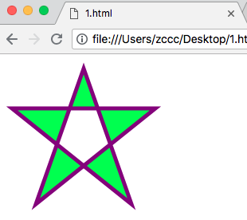

# HTML5 内联 SVG

---

### HTML5 支持内联 SVG。

---

### 什么是 SVG ？

* SVG 指可伸缩矢量图形（Scalable Vector Graphics）
* SVG 用于定义用于网络的基于矢量的图形
* SVG 使用 XML 格式定义图形
* SVG 图像在放大或改变尺寸的情况下其图形质量不会有损失
* SVG 是万维网联盟的标准

---

### SVG 的优势

与其他图像格式相比（比如 JPEG 和 GIF），使用 SVG 的优势在于：

* SVG 图像可通过文本编辑器来创建和修改
* SVG 图像可被搜索、索引、脚本化或压缩
* SVG 是可伸缩的
* SVG 图像可在任何的分辨率下被高质量的打印
* SVG 可在图像质量不下降的情况下呗放大

---

### 浏览器支持

Internet Explorer 9、Firefox、Opera、Chrome 以及 Safari 支持内联 SVG。

---

### 把 SVG 直接嵌入 HTML 页面

在 HTML5 中，您能够将 SVG 元素直接嵌入 HTML 页面中：



```
<!DOCTYPE html>
<html>
<head>
    <meta charset="utf-8">
    <title></title>
</head>
<body>
    <svg xmlns="http://www.w3.org/2000/svg" version="1.1" height="190">
        <polygon points="100,10 40,180 190,60 10,60 160,180" style="fill:lime; stroke:purple; stroke-width:5; fill-rule:evenodd;" />
    </svg>
</body>
</html>
```

---
