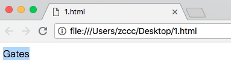
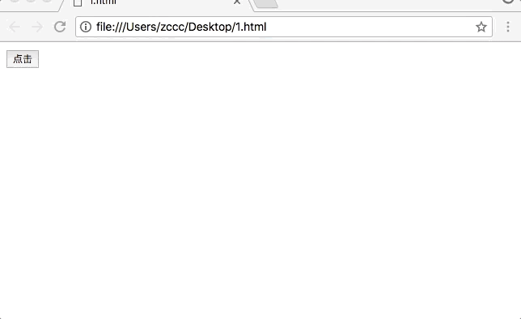

# HTML 本地存储

---

### HTML 本地存储：优于 cookies。

---

### 什么是 HTML 本地存储 ？

通过本地存储（Local Storage），web 应用程序能够在用户浏览器中对数据进行本地的存储。

在 HTML5 之前，应用程序数据只能存储在 cookie 中，包括每个服务器请求。本地存储存储则更安全，并且可在不影响网站性能的前提下降大量数据存储于本地。

于 cookie 不同，存储限制要大的多（至少 5 MB），并且信息不回被传输到服务器。

本地存储经由起源地（origin）（经由域和协议）。所有页面，从起源地，能够存储和访问相同的数据。

---

### HTML 本地存储对象

HTML 本地存储提供了两个在客户端存储数据的对象：

* window.localStorage - 存储没有截止日期的数据
* window.sessionStorage - 针对一个 session 来存储数据（当关闭浏览器标签页时数据会丢失）

在使用本地存储时，请检测 localStorage 和 sessionStorage 的浏览器支持：

```
if (typeof(Storage) !== "undefined") {
    // 针对 localStorage/sessionStorage 的代码
} else {
    // 抱歉！不支持 Web Storage ..
}
```

---

### localStorage 对象

localStorage 对象存储的是没有截止日期的数据。当浏览器被关闭时数据不会被删除，在下一天、周或年中、都是可用的。

实例：

```
<!DOCTYPE HTML>
<html>
<head>
    <meta charset="utf-8">
</head>
<body>
    <div id="result"></div>
    <script type="text/javascript">
        // 存储
        localStorage.setItem("lastname", "Gates");
        // 取回
        document.getElementById("result").innerHTML = localStorage.getItem("lastname");
    </script>
</body>
</html>
```



实例解释：

* 存储 localStorage 键值对，其中 key="lastname"，value="Gates"
* 取回 lastname 的值，并把塔插入到 id="result" 的元素中

上面的例子也可以这样写：

```
<!DOCTYPE HTML>
<html>
<head>
    <meta charset="utf-8">
</head>
<body>
    <div id="result"></div>
    <script type="text/javascript">
        // 存储
        localStorage.lastname = "Gates";
        // 取回
        document.getElementById("result").innerHTML = localStorage.lastname;
    </script>
</body>
</html>
```

删除 lastname 的 localStorage 项目的语法如下：

```
<!DOCTYPE HTML>
<html>
<head>
    <meta charset="utf-8">
</head>
<body>
    <div id="result"></div>
    <script type="text/javascript">
        // 删除
        localStorage.removeItem("lastname");
    </script>
</body>
</html>
```

注释：键值对始终存储为字符串，如果需要请记得把他们转换为其他格式！

下面的例子对用户点击按钮的次数进行计数。在代码中，值字符串被转换为数值，依次对计数进行递增：

```
<!DOCTYPE HTML>
<html>
<head>
    <meta charset="utf-8">
    <script type="text/javascript">
        function show_click_count() {
            alert('haha')
            if (localStorage.clickcount) {
                localStorage.clickcount = Number(localStorage.clickcount) + 1;
            } else {
                localStorage.clickcount = 1;
            }
            document.getElementById("result").innerHTML = "您已经点击这个按钮 " + localStorage.clickcount + " 次。";
        }
    </script>
</head>
<body>
    <div id="result"></div>
    <button type="button" onclick="show_click_count()">点击</button>
</body>
</html>
```



---

### sessionStorage 对象

sessionStorage 对象等同 localStorage 对象，不同之处在于只对一个 session 存储数据。如果用户关闭了具体的浏览器标签页，数据也会被删除。

下例在当前 session 中对用户点击按钮进行计数：

```
<!DOCTYPE HTML>
<html>
<head>
    <meta charset="utf-8">
    <script type="text/javascript">
        function show_click_count() {
            if (sessionStorage.clickcount) {
                sessionStorage.clickcount = Number(sessionStorage.clickcount) + 1;
            } else {
                sessionStorage.clickcount = 1;
            }
            document.getElementById("result").innerHTML = "在本次 session 中您已经点击这个按钮 " + sessionStorage.clickcount + " 次。";
        }
    </script>
</head>
<body>
    <div id="result"></div>
    <button type="button" onclick="show_click_count()">点击</button>
</body>
</html>
```


---
