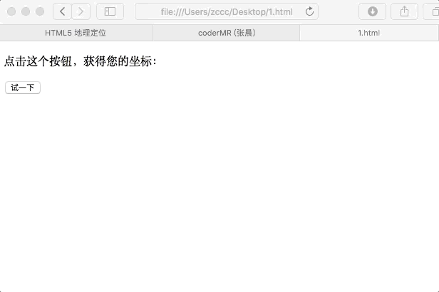

# HTML5 地理定位

---

### HTML5 Geolocation（地理定位）用于定位用户的位置。

---

### 定位用户的位置

HTML5 Geolocation API 用于获得用户的地理位置。

鉴于该特性可能侵犯用户的隐私，除非用户同意，否则用户位置信息是不可用的。

---

### 浏览器支持

Internet Explorer 9、Firefox、Chrome、Safari 以及 Opera 支持地理定位。

注释：对于拥有 GPS 的设备，比如 iPhone，地理定位更加精确。

---

### HTML5 - 使用地理定位

请使用 getCurrentPosition() 方法来获得用户的位置。

下例是一个简单的地理定位实例，可返回用户位置的精度和纬度。

```
<!DOCTYPE html>
<html>
<body>
    <p id="demo">点击这个按钮，获得您的坐标：</p>
    <button onclick="getLocation()">试一下</button>
    <script>
        var x = document.getElementById("demo");
        function getLocation() {
            if (navigator.geolocation) {
                navigator.geolocation.getCurrentPosition(showPosition);
            } else { 
                x.innerHTML="Geolocation is not supported by this browser.";
            }
        }
        function showPosition(position) {
            x.innerHTML="Latitude: " + position.coords.latitude + "<br />Longitude: " + position.coords.longitude;  
        }
</script>
</body>
</html>
```


例子解释：

* 检测是否支持地理定位
* 如果支持，则运行 getCurrentPosition()方法。如果不支持，则向用户显示一段消息。
* 如果 getCurrentPosition()运行成功，则向参数showPostion中规定的函数函数返回一个 coordinates 对象
* showPosition() 函数获得并显示经度和纬度

上面的例子是一个非常基础的地理定位脚本，不含错误处理。

---

### 处理错误和拒绝

getCurrentPosition() 方法的第二个参数用于处理错误。它规定当获取用户位置失败时运行的函数：



```
<!DOCTYPE html>
<head>
    <meta charset="utf-8">
</head>
<html>
<body>
    <p id="demo">点击这个按钮，获得您的坐标：</p>
    <button onclick="getLocation()">试一下</button>
    <script>
        var x = document.getElementById("demo");
        function getLocation() {
            if (navigator.geolocation) {
                navigator.geolocation.getCurrentPosition(showPosition, showError);
            } else { 
                x.innerHTML = "Geolocation is not supported by this browser.";
            }
        }
        function showPosition(position) {
            x.innerHTML = "Latitude: " + position.coords.latitude + "<br />Longitude: " + position.coords.longitude;  
        }
        function showError(error) {
            switch(error.code) {
                case error.PERMISSION_DENIED:
                    x.innerHTML="User denied the request for Geolocation."
                    break;
                case error.POSITION_UNAVAILABLE:
                    x.innerHTML="Location information is unavailable."
                    break;
                case error.TIMEOUT:
                    x.innerHTML="The request to get user location timed out."
                    break;
                case error.UNKNOWN_ERROR:
                    x.innerHTML="An unknown error occurred."
                    break;
            }
        }
    </script>
</body>
</html>
```

错误代码：

* Permission denied - 用户不允许地理定位
* Position unavailable - 无法获取当前位置
* Timeout - 操作超时

---

### 在地图中显示结果

如需在地图中显示结果，您需要访问可使用经纬度的地图服务，比如谷歌地图或百度地图：


```
<!DOCTYPE html>
<head>
    <meta charset="utf-8">
</head>
<html>
<body>
    <div id="mapholder"></div>
    <p id="demo">点击这个按钮，获得您的坐标：</p>
    <button onclick="getLocation()">试一下</button>
    <script>
        var x = document.getElementById("demo");
        function getLocation() {
            if (navigator.geolocation) {
                navigator.geolocation.getCurrentPosition(showPosition, showError);
            } else { 
                x.innerHTML = "Geolocation is not supported by this browser.";
            }
        }
        function showPosition(position) {
            var latlon = position.coords.latitude + "," + position.coords.longitude;
            var img_url = "http://maps.googleapis.com/maps/api/staticmap?center=" + latlon + "&zoom=14&size=400x300&sensor=false";
            document.getElementById("mapholder").innerHTML = "";
        }
        function showError(error) {
            switch(error.code) {
                case error.PERMISSION_DENIED:
                    x.innerHTML="User denied the request for Geolocation."
                    break;
                case error.POSITION_UNAVAILABLE:
                    x.innerHTML="Location information is unavailable."
                    break;
                case error.TIMEOUT:
                    x.innerHTML="The request to get user location timed out."
                    break;
                case error.UNKNOWN_ERROR:
                    x.innerHTML="An unknown error occurred."
                    break;
            }
        }
    </script>
</body>
</html>
```

在上例中，我们使用返回的经纬度数据在谷歌地图中显示位置（使用静态图像）。

---

### 交互式地图


```
<!DOCTYPE html>
<html>
    <head>
        <meta charset="utf-8">
    </head>
<body>
    <p id="demo">点击这个按钮，获得您的位置：</p>
    <button onclick="getLocation()">试一下</button>
    <div id="mapholder"></div>
    <script src="http://maps.google.com/maps/api/js?sensor=false"></script>
    <script>
        var x=document.getElementById("demo");
        function getLocation() {
            if (navigator.geolocation) {
                navigator.geolocation.getCurrentPosition(showPosition,showError);
            } else{
                x.innerHTML="Geolocation is not supported by this browser.";
            }
        }

        function showPosition(position) {
            lat=position.coords.latitude;
            lon=position.coords.longitude;
            latlon=new google.maps.LatLng(lat, lon)
            mapholder=document.getElementById('mapholder')
            mapholder.style.height='250px';
            mapholder.style.width='500px';

            var myOptions={
                center:latlon,zoom:14,
                mapTypeId:google.maps.MapTypeId.ROADMAP,
                mapTypeControl:false,
                navigationControlOptions:{
                    style:google.maps.NavigationControlStyle.SMALL
                }
            };
            var map=new google.maps.Map(document.getElementById("mapholder"),myOptions);
            var marker=new google.maps.Marker({position:latlon,map:map,title:"You are here!"});
        }

        function showError(error) {
            switch(error.code) {
                case error.PERMISSION_DENIED:
                    x.innerHTML="User denied the request for Geolocation."
                    break;
                case error.POSITION_UNAVAILABLE:
                    x.innerHTML="Location information is unavailable."
                    break;
                case error.TIMEOUT:
                    x.innerHTML="The request to get user location timed out."
                    break;
                case error.UNKNOWN_ERROR:
                    x.innerHTML="An unknown error occurred."
                    break;
            }
        }
    </script>
</body>
</html>
```

上面的例子展示如何使用脚本来显示带有大头针、缩放和拖拽功能的交互式地图。

---

### 给定位置的信息

本节演示的是如何在地图上显示用户的位置。不过，地理定位对于给定位置的信息同样很有用处。

案例：

* 更新本地信息
* 显示用户周围的兴趣点
* 交互式车载导航系统（GPS）

---

### getCurrentPosition() 方法 - 返回数据

若成功，则 getCurrentPosition() 方法返回对象。始终会返回 latitude、longitude 以及 accuracy 属性。如果可用，则会返回其他下面的属性。

| 属性 | 描述
|------|-----
| coords.latitude | 十进制数的维度
| coords.longitude | 十进制数的经度
| coords.accuracy | 位置精度
| coords.altitude | 海拔，单位是米
| coords.alttitudeAccuracy | 位置的海拔精度
| coords.heading | 方向，从正北开始以度计
| coords.speed | 速度，以米/每秒计
| timestamp | 响应的日期/时间

---

### Geolocation 对象 - 其他有趣的方法

watchPosition() - 返回用户的当前位置，并继续返回用户移动时的更新位置（就像汽车上的 GPS）。

clearWatch() - 停止 watchPosition() 方法。

下面的例子展示 watchPosition() 方法。您需要一台精确的 GPS 设备来测试该例（比如 iPhone）：

```
<!DOCTYPE html>
<html>
    <head>
        <meta charset="utf-8">
    </head>
<body>
    <p id="demo">点击这个按钮，获得您的位置：</p>
    <button onclick="getLocation()">试一下</button>
    <div id="mapholder"></div>
    <script>
        var x = document.getElementById("demo");
        function getLocation() {
            if (navigator.geolocation) {
                navigator.geolocation.watchPosition(showPosition);
            } else{
                x.innerHTML="Geolocation is not supported by this browser.";
            }
        }
        function showPosition(position) {
            x.innerHTML="Latitude: " + position.coords.latitude + "<br />Longitude: " + position.coords.longitude;
        }
    </script>
</body>
</html>
```

---
