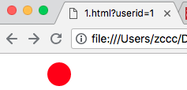

# HTML5 Canvas

---

### canvas 元素用于在网页上绘制图形

---

### 什么是 canvas ？

HTML5 的 canvas 元素使用 JavaScript 在网页上绘制图像。

画布是一个矩形区域，您可以控制其每一个像素。

canvas 拥有多种绘制路径、矩形、圆形、字符以及添加图像的方法。

---

### 创建 Canvas 元素

向 HTML5 页面添加 canvas 元素。

规定元素的 id、宽度和高度：

```
<canvas id="myCanvas" width="200" height="100"></canvas>
```

---

### 通过 JavaScript 来绘制

canvas 元素本身是没有绘制能力的。所有的绘制工作必须在 JavaScript 内部完成：

```
<!DOCTYPE html>
<html>
<head>
    <meta charset="utf-8">
    <title></title>
</head>
<body>
    <canvas id="myCanvas" width="200" height="200">
        <script type="text/javascript">
            var c = document.getElementById("myCanvas");
            var cxt = c.getContext("2d");
            cxt.fillStyle = "#FF0000";
            cxt.fillRect(0,0,150,75);
        </script>
    </canvas>
</body>
</html>
```

JavaScript 使用 id 来寻找 canvas 元素：

```
var c = document.getElementById("myCanvas");
```

然后，创建 context 对象：

```
var cxt = c.getContext("2d");
```

getContext("2d") 对象是内建的 HTML5 对象，拥有多种绘制路径、矩形、圆形、字符以及添加图像的方法。

下面的两行代码绘制一个红色的矩形：

```
cxt.fillStyle = "#FF0000";
cxt.fillRect(0, 0, 150, 75);
```

fillStyle 属性将其染成红色，fillRect 方法规定了形状、位置和尺寸。

---

### 理解坐标

上面的 fillRect 方法拥有参数（0, 0, 150, 75）。

意思是：在画布上绘制 150 x 75 的矩形，从左上角开始（0, 0）。

---

### 更多 Canvas 实例

下面的在 canvas 元素上进行绘画的更多实例：

### 实例 - 线条

通过指定从何处开始，在何处结束，来绘制一条线：


```
<!DOCTYPE html>
<html>
<head>
    <meta charset="utf-8">
    <title></title>
</head>
<body>
    <canvas id="myCanvas" width="200" height="200">
        <script type="text/javascript">
            var c = document.getElementById("myCanvas");
            var cxt = c.getContext("2d");
            cxt.moveTo(10, 10);
            cxt.lineTo(150, 10);
            cxt.lineTo(150, 50);
            cxt.lineTo(10, 10);
            cxt.stroke();
        </script>
    </canvas>
</body>
</html>
```

### 实例 - 圆形

通过规定尺寸、颜色和位置，来绘制一个圆：



```
<!DOCTYPE html>
<html>
<head>
    <meta charset="utf-8">
    <title></title>
</head>
<body>
    <canvas id="myCanvas" width="200" height="200">
        <script type="text/javascript">
            var c = document.getElementById("myCanvas");
            var cxt = c.getContext("2d");
            cxt.fillStyle = "#FF0000";
            cxt.beginPath();
            cxt.arc(70, 18, 15, 0, Math.PI * 2, true);
            cxt.closePath();
            cxt.fill();
        </script>
    </canvas>
</body>
</html>
```

### 实例 - 渐变

使用您指定的颜色来沪指渐变背景：


```
<!DOCTYPE html>
<html>
<head>
    <meta charset="utf-8">
    <title></title>
</head>
<body>
    <canvas id="myCanvas" width="200" height="200">
        <script type="text/javascript">
            var c = document.getElementById("myCanvas");
            var cxt = c.getContext("2d");
            var grd = cxt.createLinearGradient(0, 0, 175, 50);
            grd.addColorStop(0, "#FF0000");
            grd.addColorStop(1, "#00FF00");
            cxt.fillStyle = grd;
            cxt.fillRect(0, 0, 175, 50);
        </script>
    </canvas>
</body>
</html>
```

### 实例 - 图像

把一副图片放置在画布上：


```
<!DOCTYPE html>
<html>
<head>
    <meta charset="utf-8">
    <title></title>
</head>
<body>
    <canvas id="myCanvas" width="400" height="400">
        <script type="text/javascript">
            var c = document.getElementById("myCanvas");
            var cxt = c.getContext("2d");
            var img = new Image()
            img.src = "pig_peppa.jpg"
            img.onload = function() {
                cxt.drawImage(img,0,0);
            }
        </script>
    </canvas>
</body>
</html>
```

注释：图片显示不出来的原因可能是因为图片还未被加载完毕就调用了 drawImage 方法。故为 img 对象设置加载完毕的回调函数，在回调函数中调用 drawImage 方法。

---
