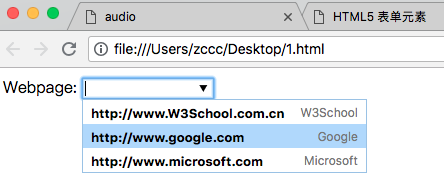
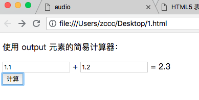

# HTML5 表单元素

---

### HTML5 的新的表单元素：

HTML5 拥有若干涉及表单的元素和属性。

本章介绍以下新的表单元素：

* datalist
* keygen
* output

---

<table class="dataintable">
<tr>
<th style="width:25%;">Input type</th>
<th style="width:15%;">IE</th>
<th style="width:15%;">Firefox</th>
<th style="width:15%;">Opera</th>
<th style="width:15%;">Chrome</th>
<th style="width:15%;">Safari</th>
</tr>

<tr>
<td>datalist</td>
<td><span class="marked">No</span></td>
<td><span class="marked">No</span></td>
<td>9.5</td>
<td><span class="marked">No</span></td>
<td><span class="marked">No</span></td>
</tr>

<tr>
<td>keygen</td>
<td><span class="marked">No</span></td>
<td><span class="marked">No</span></td>
<td>10.5</td>
<td>3.0</td>
<td><span class="marked">No</span></td>
</tr>

<tr>
<td>output</td>
<td><span class="marked">No</span></td>
<td><span class="marked">No</span></td>
<td>9.5</td>
<td><span class="marked">No</span></td>
<td><span class="marked">No</span></td>
</tr>
</table>

---

### datalist 元素


datalist 元素规定输入域的选项列表。

列表是通过 datalist 内的 option 元素创建的。

如需把 datalist 绑定到输入域，请用输入域的 list 属性引用 datalist 的 id：

```
<!DOCTYPE html>
<html>
<head>
    <title>
    </title>
    <meta charset="utf-8">
</head>
<body>
    <form action="www.baidu">
        Webpage: <input type="url" list="url_list" name="link" />
        <datalist id="url_list">
            <option label="W3School" value="http://www.W3School.com.cn" />
            <option label="Google" value="http://www.google.com" />
            <option label="Microsoft" value="http://www.microsoft.com" />
        </datalist>
    </form>
</body>
</html>
```



提示：option 元素永远都要设置 value 属性。

---

### keygen 元素

keygen 元素的作用是提供一种验证用户的可靠方法。

keygen 元素是密钥对生成器（key-pair generator）。当提交表单时，会生成两个键，一个是私钥，一个公钥。

私钥（private key）存储于客户端，公钥（public key）则被发送到服务器。公钥可用于之后验证用户的客户端证书（client certificate）。

目前，浏览器对此元素的糟糕的支持度不足以使其成为一种有用的安全标准。

```
<!DOCTYPE html>
<html>
<head>
    <title>
    </title>
    <meta charset="utf-8">
</head>
<body>
    <form action="demo_form.asp" method="get">
        Username: <input type="text" name="usr_name" />
        Encryption: <keygen name="security" />
        <input type="submit" />
    </form>
</body>
</html>
```

---

### output 元素

output 元素用于不同类型的输出，比如计算或脚本输出：

```
<!DOCTYPE HTML>
<html>
<head>
    <title>calculate</title>
    <meta charset="utf-8">
    <script type="text/javascript">
        function resCalc() {
            numA = document.getElementById("num_a").value;
            numB = document.getElementById("num_b").value;
            document.getElementById("result").value = Number(numA) + Number(numB);
        }
    </script>
</head>
<body>
    <p>使用 output 元素的简易计算器：</p>
    <form onsubmit="return false">
        <input id="num_a" /> +
        <input id="num_b" /> =
        <output id="result"></output>
        <br /><br />
        <button type="button" onclick="resCalc()">计算</button>
    </form>
</body>
</html>
```


