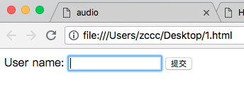
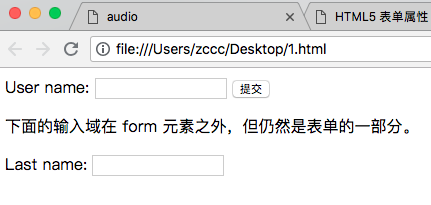
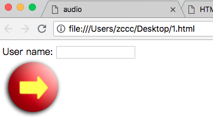
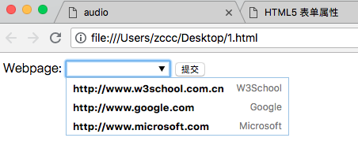
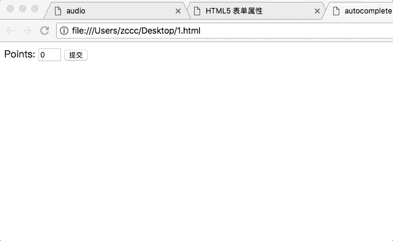
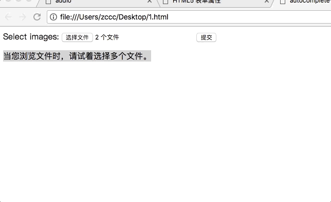
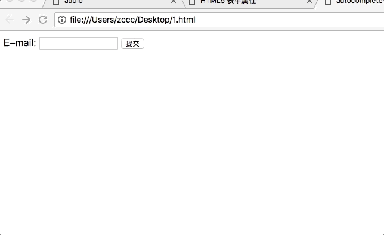
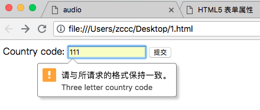
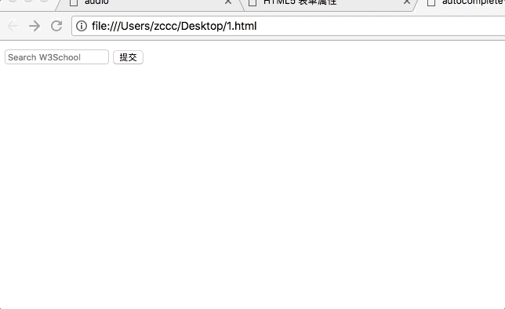

# HTML5 表单属性

---

### HTML5 的新的表单属性

本章讲解涉及 &lt;form&gt; 和 &lt;input&gt; 元素的新属性。

### 新的 form 属性：

* autocomplete
* novalidate

### 新的 input 属性：

* autocomplete
* autofocus
* form 
* form overrides（formaction、formenctype、formmethod、formnovalidate、formtarget）
* height & width
* list
* min、max、step
* multiple
* pattern 
* placeholder
* required

---

### 浏览器支持

<table class="dataintable">
<tr>
<th style="width:25%;">Input type</th>
<th style="width:15%;">IE</th>
<th style="width:15%;">Firefox</th>
<th style="width:15%;">Opera</th>
<th style="width:15%;">Chrome</th>
<th style="width:15%;">Safari</th>
</tr>

<tr>
<td>autocomplete</td>
<td>8.0</td>
<td>3.5</td>
<td>9.5</td>
<td>3.0</td>
<td>4.0</td>
</tr>

<tr>
<td>autofocus</td>
<td><span class="marked">No</span></td>
<td><span class="marked">No</span></td>
<td>10.0</td>
<td>3.0</td>
<td>4.0</td>
</tr>

<tr>
<td>form</td>
<td><span class="marked">No</span></td>
<td><span class="marked">No</span></td>
<td>9.5</td>
<td><span class="marked">No</span></td>
<td><span class="marked">No</span></td>
</tr>

<tr>
<td>form overrides</td>
<td><span class="marked">No</span></td>
<td><span class="marked">No</span></td>
<td>10.5</td>
<td><span class="marked">No</span></td>
<td><span class="marked">No</span></td>
</tr>

<tr>
<td>height and width</td>
<td>8.0</td>
<td>3.5</td>
<td>9.5</td>
<td>3.0</td>
<td>4.0</td>
</tr>

<tr>
<td>list</td>
<td><span class="marked">No</span></td>
<td><span class="marked">No</span></td>
<td>9.5</td>
<td><span class="marked">No</span></td>
<td><span class="marked">No</span></td>
</tr>

<tr>
<td>min, max and step</td>
<td><span class="marked">No</span></td>
<td><span class="marked">No</span></td>
<td>9.5</td>
<td>3.0</td>
<td><span class="marked">No</span></td>
</tr>

<tr>
<td>multiple</td>
<td><span class="marked">No</span></td>
<td>3.5</td>
<td><span class="marked">No</span></td>
<td>3.0</td>
<td>4.0</td>
</tr>

<tr>
<td>novalidate</td>
<td><span class="marked">No</span></td>
<td><span class="marked">No</span></td>
<td><span class="marked">No</span></td>
<td><span class="marked">No</span></td>
<td><span class="marked">No</span></td>
</tr>

<tr>
<td>pattern</td>
<td><span class="marked">No</span></td>
<td><span class="marked">No</span></td>
<td>9.5</td>
<td>3.0</td>
<td><span class="marked">No</span></td>
</tr>

<tr>
<td>placeholder</td>
<td><span class="marked">No</span></td>
<td><span class="marked">No</span></td>
<td><span class="marked">No</span></td>
<td>3.0</td>
<td>3.0</td>
</tr>

<tr>
<td>required</td>
<td><span class="marked">No</span></td>
<td><span class="marked">No</span></td>
<td>9.5</td>
<td>3.0</td>
<td><span class="marked">No</span></td>
</tr>
</table>

---

### autocomplete 属性

autocomplete 属性规定 form 或 input 域应该拥有自动完成功能。

当自动完成开启，浏览器会基于用户之前的输入值自动填写值。

注释：autocomplete 适用于 &lt;form&gt; 标签，以及以下类型的 &lt;input&gt; 标签：text, search, url, telephone, email, password, datepickers, range 以及 color。

当用户在自动完成域中开始输入时，浏览器应该在该域中显示填写的选项：

```
<!DOCTYPE HTML>
<html>
<head>
    <title>autocomplete</title>
    <meta charset="utf-8">
</head>
<body>
    <form action="http://www.w3school.com.cn/example/html5/demo_form.asp" method="get" autocomplete="on">
        First name:<input type="text" name="fname" /><br />
        Last name: <input type="text" name="lname" /><br />
        E-mail: <input type="email" name="email" autocomplete="off" /><br />
        <input type="submit" />
    </form>
    <p>请填写并提交此表单，然后重载页面，来查看自动完成功能是如何工作的。</p>
    <p>请注意，表单的自动完成功能是打开的，而 e-mail 域是关闭的。</p>
</body>
</html>
```


注释：在某些浏览器中，您可能需要启用自动完成功能，以使该属性生效。

---

### autofocus 属性

autofocus 属性规定在页面加载时，域自动地获得焦点。

注释：autofocus 属性适用于所有 &lt;input&gt; 标签的类型。

```
<!DOCTYPE HTML>
<html>
<head>
    <title>autocomplete</title>
    <meta charset="utf-8">
</head>
<body>
    <form action="http://www.w3school.com.cn/example/html5/demo_form.asp" method="get">
        User name: <input type="text" name="user_name" autofocus="autofocus" />
        <input type="submit" />
    </form>
</body>
</html>
```



---

### form 属性

form 属性规定输入域所属的一个或多个表单。

注释：form 属性适用于所有 &lt;input&gt; 标签的类型。

提示：如需引用一个以上的表单，请使用空格分割的表单 id 列表。

form 属性必须引用所属表单的 id：

```
<!DOCTYPE HTML>
<html>
<head>
    <title>autocomplete</title>
    <meta charset="utf-8">
</head>
<body>
    <form action="http://www.w3school.com.cn/example/html5/demo_form.asp" method="get" id="user_form">
        User name: <input type="text" name="user_name" />
        <input type="submit" />
    </form>
    <p>下面的输入域在 form 元素之外，但仍然是表单的一部分。</p>
    Last name: <input type="text" name="lname" form="user_form" />
</body>
</html>
```



---

### height 和 width 属性

height 和 width 属性规定用于 image 类型的 input 标签的图像高度和宽度。

注释：height 和 width 属性只适用于 image 类型的 <input> 标签。

注释：请始终规定图像的尺寸，如果浏览器不清楚图像的尺寸，则页面会在图像加载时闪烁。

```
<!DOCTYPE HTML>
<html>
<head>
    <title>autocomplete</title>
    <meta charset="utf-8">
</head>
<body>
    <form action="http://www.w3school.com.cn/example/html5/demo_form.asp" method="get">
        User name: <input type="text" name="user_name" /><br />
        <input type="image" src="http://www.w3school.com.cn/i/eg_submit.jpg" width="99" height="99" />
    </form>
</body>
</html>
```



---

### list 属性

list 属性规定输入域的 datalist。datalist 是输入域的选项列表。

注释：list 属性适用于以下类型的 &lt;input&gt; 标签：text, search, url, telephone, email, date pickers, number, range 以及 color。

```
<!DOCTYPE HTML>
<html>
<head>
    <title>autocomplete</title>
    <meta charset="utf-8">
</head>
<body>
    <form action="http://www.w3school.com.cn/example/html5/demo_form.asp" method="get">
        Webpage: <input type="url" list="url_list" name="link" />
        <datalist id="url_list">
            <option label="W3School" value="http://www.w3school.com.cn" />
            <option label="Google" value="http://www.google.com" />
            <option label="Microsoft" value="http://www.microsoft.com" />
        </datalist>
        <input type="submit" />
    </form>
</body>
</html>
```



---

### min、max 和 step 属性

min、max 和 step 属性用于为包含数字或日期的 input 类型规定限定（约束）。

max 属性规定输入域所允许的最大值。

min 属性规定输入域所允许的最小值。

step 属性为输入域规定合法的数字间隔（如果 step="3"，则合法的数是 -3,0,3,6 等）。

注释：min、max 和 step 属性适用于以下类型的 &lt;input&gt; 标签：date pickers、number 以及 range。

下面的例子显示一个数字域，该域接受介于 0 到 10 之间的值，且步进为 3（即合法的值为 0、3、6 和 9）：

```
<!DOCTYPE HTML>
<html>
<head>
    <title>autocomplete</title>
    <meta charset="utf-8">
</head>
<body>
    <form action="http://www.w3school.com.cn/example/html5/demo_form.asp" method="get">
        Points: <input type="number" name="points" min="0" max="10" step="3"/>
        <input type="submit" />
    </form>
</body>
</html>
```



---

### multiple 属性

multiple 属性规定输入域中可选择多个值。

注释：multiple 属性适用于以下类型的 &lt;input&gt; 标签：email 和 file。

```
<!DOCTYPE HTML>
<html>
<head>
    <title>autocomplete</title>
    <meta charset="utf-8">
</head>
<body>
    <form action="http://www.w3school.com.cn/example/html5/demo_form.asp" method="get">
        Select images: <input type="file" name="img" multiple="multiple" />
        <input type="submit" />
    </form>
    <p>当您浏览文件时，请试着选择多个文件。</p>
</body>
</html>
```



---

### novalidate 属性

novalidate 属性规定在提交表单时不应该验证 form 或 input 域。

novalidate 属性属于 &lt;form&gt; 属性。

注释：novalidate 属性适用于 &lt;form&gt; 以及会对以下类型的 &lt;input&gt; 标签：text, search, url, telephone, email, password, date pickers, range 以及 color 起作用。

```
<!DOCTYPE HTML>
<html>
<head>
    <title>autocomplete</title>
    <meta charset="utf-8">
</head>
<body>
    <form action="http://www.w3school.com.cn/example/html5/demo_form.asp" method="get" novalidate="novalidate">
        E-mail: <input type="email" name="user_email" />
        <input type="submit" />
    </form>
</body>
</html>
```



---

### pattern 属性

pattern 属性规定用于验证 input 域的模式（pattern）。

模式（pattern） 是正则表达式。您可以在我们的 JavaScript 教程中学习到有关正则表达式的内容。

注释：pattern 属性适用于以下类型的 &lt;input&gt; 标签：text, search, url, telephone, email 以及 password。

下面的例子显示了一个只能包含三个字母的文本域（不含数字及特殊字符）：

```
<!DOCTYPE HTML>
<html>
<head>
    <title>autocomplete</title>
    <meta charset="utf-8">
</head>
<body>
    <form action="http://www.w3school.com.cn/example/html5/demo_form.asp" method="get">
        Country code: <input type="text" name="country_code" pattern="[A-z]{3}"
        title="Three letter country code" />
        <input type="submit" />
    </form>
</body>
</html>
```



---

### placeholder 属性

placeholder 属性提供一种提示（hint），描述输入域所期待的值。

注释：placeholder 属性适用于以下类型的 &lt;input&gt; 标签：text, search, url, telephone, email 以及 password。

提示（hint）会在输入域为空时显示出现，会在输入域获得焦点时消失：

```
<!DOCTYPE HTML>
<html>
<head>
    <title>autocomplete</title>
    <meta charset="utf-8">
</head>
<body>
    <form action="http://www.w3school.com.cn/example/html5/demo_form.asp" method="get">
        <input type="search" name="user_search" placeholder="Search W3School" />
        <input type="submit" />
    </form>
</body>
</html>
```



---

### required 属性

required 属性规定必须在提交之前填写输入域（不能为空）。

注释：required 属性适用于以下类型的 <input> 标签：text, search, url, telephone, email, password, date pickers, number, checkbox, radio 以及 file。

```
<!DOCTYPE HTML>
<html>
<head>
    <title>autocomplete</title>
    <meta charset="utf-8">
</head>
<body>
    <form action="http://www.w3school.com.cn/example/html5/demo_form.asp" method="get">
        Name: <input type="text" name="usr_name" required="required" />
        <input type="submit" />
    </form>
</body>
</html>
```


---

### formaction 属性

formaction 属性规定当提交表单时处理该输入空间的文件的 URL。

formaction 属性覆盖 &lt;form&gt; 元素的 action 属性。

formaction 属性适用于 type="submit" 以及 type="image"。

```
<!DOCTYPE html>
<html>
<head>
    <title>
    </title>
    <meta charset="utf-8">
</head>
<body>
    <form action="action_page.php">
        First name: <input type="text" name="fname" /><br />
        Last name: <input type="text" name="lname" /><br />
        <input type="submit" value="Submit" /><br />
        <input type="submit" formaction="demo_admin.asp" value="Submit as admin" />
    </form> 
</body>
</html>
```

### formenctype 属性

formenctype 属性规定当把表单数据（form-data）提交至服务器时如何对其进行编码（仅针对 method="post" 的表单）。

formenctype 属性覆盖 &lt;form&gt; 元素的 enctype 属性。

formenctype 属性适用于 type="submit" 以及 type="image"。

发送默认编码以及编码为 "multipart/form-data"（第二个提交按钮）的表单数据（form-data）：

```
<!DOCTYPE html>
<html>
<head>
    <title>
    </title>
    <meta charset="utf-8">
</head>
<body>
    <form action="demo_post_enctype.asp" method="post">
        First name: <input type="text" name="fname" /><br />
        <input type="submit" value="Submit" />
        <input type="submit" formenctype="multipart/form-data"
   value="Submit as Multipart/form-data" />
    </form> 
</body>
</html>
```

---

### formmethod 属性

formmethod 属性定义用以向 action URL 发送表单数据的 HTTP 方法。

formmethod 属性覆盖 &lt;form&gt; 元素的 method 属性。

formmethod 属性适用于 type="submit" 以及 type="image"。

```
<!DOCTYPE html>
<html>
<head>
    <title>
    </title>
    <meta charset="utf-8">
</head>
<body>
    <form action="action_page.php" method="get">
        First name: <input type="text" name="fname" /><br />
        Last name: <input type="text" name="lname"><br />
        <input type="submit" value="Submit" />
        <input type="submit" formmethod="post" formaction="demo_post.asp"
   value="Submit using POST" />
    </form> 
</body>
</html>
```

---

### formtarget 属性

formtarget 属性规定的名称或关键词指示提交表单后在何处显示接收到的响应。

formtarget 属性会覆盖 &lt;form&gt; 元素的 target 属性。

formtarget 属性可与 type="submit" 和 type="image" 使用。

```
<!DOCTYPE html>
<html>
<head>
    <title>
    </title>
    <meta charset="utf-8">
</head>
<body>
    <form action="action_page.php">
        First name: <input type="text" name="fname" /><br />
        Last name: <input type="text" name="lname" /><br />
        <input type="submit" value="Submit as normal" />
        <input type="submit" formtarget="_blank" value="Submit to a new window" />
    </form>
</body>
</html>
```

---

### formnovalidate 属性

novalidate 属性是布尔属性。

如果设置，则规定在提交表单时不对 &lt;input&gt; 元素进行验证。

formnovalidate 属性覆盖 &lt;form&gt; 元素的 novalidate 属性。

formnovalidate 属性可用于 type="submit"。

```
<!DOCTYPE html>
<html>
<head>
    <title>
    </title>
    <meta charset="utf-8">
</head>
<body>
    <form>
        E-mail: <input type="email" name="userid" /><br />
        E-mail: <input type="email" name="userid" formnovalidate="formnovalidate" />
    </form>
</body>
</html>
```

注释：Chorme 并不支持这一属性，让我踩了半小时的坑。

---
