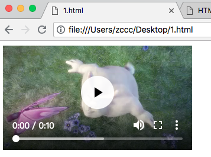

# HTML 5 视频

---

许多时髦的网站都提供视频。HTML5 提供了展示视频的标准。

---

### Web 上的视频

直到现在，仍然不存在一项旨在网页上显示视频的标准。

今天，大多数视频是通过插件（比如 Flash）来显示的。然而，并非所有的浏览器都拥有同样的插件。

HTML5 规定了一种通过 video 元素来包含视频的标准方法。

---

### 视频格式

当前，video 元素支持三种视频格式：

| 格式 | IE | Firefox | Opera | Chrome | Safari
|------|----|---------|-------|--------|-------
| Ogg | No | 3.5+ | 10.5+ | 5.0+ | No
| MPEG 4 | 9.0+ | No | No | 5.0+ | 3.0+
| WebM | No | 4.0+ | 10.6+ | 6.0+ | No

Ogg = 带有 Theora 视频编码和 Vorbis 音频编码的 Ogg 文件

MPEG4 = 带有 H.264 视频编码和 AAC 音频编码的 MPEG 4 文件

WebM = 带有 VP8 视频编码和 Vorbis 音频编码的 WebM 文件

---

### 如何工作

如需在 HTML5 中显示视频，您需要：

```
<video src="http://www.w3school.com.cn/example/html5/mov_bbb.mp4" controls="controls">
</video>
```



controls 属性提供添加播放、暂停和音量控件。

包含宽度和高度属性也是不错的注意。

&lt;video&gt; 与 &lt;/vidoe&gt; 之间插入的内容是供不支持 video 元素的浏览器显示的：

实例：

```
<!DOCTYPE HTML>
<html>
<body>
<video width="320" height="240" controls="controls">
  <source src="http://www.w3school.com.cn/i/movie.ogg" type="video/ogg">
  <source src="http://www.w3school.com.cn/i/movie.mp4" type="video/mp4">
Your browser does not support the video tag.
</video>
</body>
</html>
```

上面的例子使用一个 Ogg 文件，适用于 Firefox、Opera、Chrome 浏览器。

要确保适用于 Safari 浏览器，视频文件必须是 MPEG4 类型。

video 元素运行多个 source 元素。source 元素可以链接不同的视频文件。浏览器将使用第一个可识别的格式：

---

### Internet Explorer

Internet Explprer 8 不支持 video 元素。在 IE 9 中，将提供对使用 MPEG4 的 video 元素的支持。

---

### &lt;video&gt; 标签的属性

| 属性 | 值 | 描述
|------|----|-----
| [autoplay]()  | autoplay | 如果出现该属性，则视频在就绪后马上播放
| [controls]()  | controls | 如果出现该属性，则向用户显示控件，比如播放按钮
| [height]()  | pixels | 设置视频播放器的高度
| [loop]()  | loop | 如果出现该属性，则当媒介文件完成播放后再次开始播放
| [preload]()  | preload | 如果出现该属性，则视频在页面加载时进行加载，并预备播放
| [src]()  | url | 要播放的视频的 url
| [width]()  | pixels | 设置视频播放器的宽度

---
