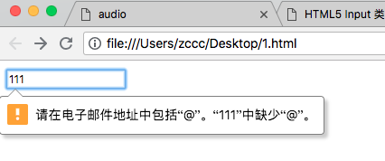
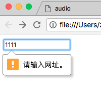
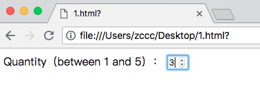
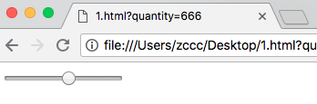

# HTML5 Input 类型

---

### HTML5 新的 Input 类型

HTML5 拥有多个新的表单输入类型。这些新特性提供了更好的输入控制和验证。

本章全面介绍这些新的输入类型：

* email
* url
* number
* range
* Date picker（date，month，week, time, datetime, datetime-local）
* search
* color

---

<table class="dataintable">
<tr>
<th style="width:25%;">Input type</th>
<th style="width:15%;">IE</th>
<th style="width:15%;">Firefox</th>
<th style="width:15%;">Opera</th>
<th style="width:15%;">Chrome</th>
<th style="width:15%;">Safari</th>
</tr>

<tr>
<td>email</td>
<td><span class="marked">No</span></td>
<td><span>4.0</span></td>
<td>9.0</td>
<td><span>10.0</span></td>
<td><span class="marked">No</span></td>
</tr>

<tr>
<td>url</td>
<td><span class="marked">No</span></td>
<td><span>4.0</span></td>
<td>9.0</td>
<td><span>10.0</span></td>
<td><span class="marked">No</span></td>
</tr>

<tr>
<td>number</td>
<td><span class="marked">No</span></td>
<td><span class="marked">No</span></td>
<td>9.0</td>
<td><span>7.0</span></td>
<td><span class="marked">No</span></td>
</tr>

<tr>
<td>range</td>
<td><span class="marked">No</span></td>
<td><span class="marked">No</span></td>
<td>9.0</td>
<td>4.0</td>
<td>4.0</td>
</tr>

<tr>
<td>Date pickers</td>
<td><span class="marked">No</span></td>
<td><span class="marked">No</span></td>
<td>9.0</td>
<td><span>10.0</span></td>
<td><span class="marked">No</span></td>
</tr>

<tr>
<td>search</td>
<td><span class="marked">No</span></td>
<td><span>4.0</span></td>
<td><span>11.0</span></td>
<td><span>10.0</span></td>
<td><span class="marked">No</span></td>
</tr>

<tr>
<td>color</td>
<td><span class="marked">No</span></td>
<td><span class="marked">No</span></td>
<td><span>11.0</span></td>
<td><span class="marked">No</span></td>
<td><span class="marked">No</span></td>
</tr>
</table>


注释：Opera 对新的输入类型的支持最好。不过您已经可以在所有主流的浏览器中使用它们了。即使不被支持，仍然可以显示为常规的文本域。

---

### 输入类型：email

&lt;input type="email"&gt; 用于包含电子邮件地址的输入字段。

根据浏览器支持，能够在被提交时自动对电子邮件地址进行验证。

某些只能手机会识别 email 类型，并在键盘增加 '.com' 以匹配电子邮件输入。

实例：

```
<!DOCTYPE html>
<html>
<head>
    <title>
    </title>
    <meta charset="utf-8">
</head>
<body>
    <form>
        <input type="email" name="email" />
    </form>
</body>
</html>
```



---

### 输入类型：url

&lt;input type="url" /&gt; 用于包含 URL 地址的输入字段。

根据浏览器支持，在提交时能够自动验证 url 字段。

某些只能手机识别 url 类型，并向键盘添加 '.com' 以匹配 url 输入。

实例：

```
<!DOCTYPE html>
<html>
<head>
    <title>
    </title>
    <meta charset="utf-8">
</head>
<body>
    <form action="www.baidu">
        <input type="url" name="url" />
    </form>
</body>
</html>
```



---

### 输入类型：number

&lt;input type="number" /&gt; 用于应该保护数字值得输入字段。

您能够对数字做出限制。

根据浏览器支持，限制可应用到输入字段。

实例：

```
<!DOCTYPE html>
<html>
<head>
    <title>
    </title>
</head>
<body>
    <form>
        Quantity（between 1 and 5）：
        <input type="number" name="quantity" min="1" max="5" />
    </form>
</body>
</html>
```



请使用下面的属性来规定对数字类型的限定：

| 属性 | 值 | 描述
|------|----|----
| max | number | 规定允许的最大值
| min | number | 规定允许的最小值
| step | number | 规定合法的数字间隔（如果 step="3"，则合法的数是 -3,0,3,6 等）
| value | number | 规定默认值

---

### 输入类型：range

&lt;input type="range" /&gt; 用于包含一定范围内的值得输入字段

根据浏览器支持，输入字段能够显示为滑块空间。

实例：

```
<!DOCTYPE html>
<html>
<head>
    <title>
    </title>
</head>
<body>
    <form>
        <input type="range" name="range" min="0" max="100" />
    </form>
</body>
</html>
```

效果：



请使用下面的属性来规定对数字类型的限定：

| 属性 | 值 | 描述
|------|----|----
| max | number | 规定允许的最大值
| min | number | 规定允许的最小值
| step | number | 规定合法的数字间隔（如果 step="3"，则合法的数是 -3,0,3,6 等）
| value | number | 规定默认值

---

### 输入类型 - Date Pickers（日期选择器）

HTML5 拥有多个可供选取日期和时间的新输入类型：

* date - 选取日、月、年
* month - 选取月、年
* week - 选取周和年
* time - 选取时间（小时和分钟）
* datetime - 选取时间、日、月、年（UTC 时间）
* datetime-local - 选取时间、日、月、年（本地时间）

---

### 输入类型：search

search 类型用于搜索域，比如站点搜索或 Google 搜索。

search 域显示为常规的文本域。

实例：

```
<!DOCTYPE html>
<html>
<head>
    <title>
    </title>
    <meta charset="utf-8">
</head>
<body>
    <form action="www.baidu">
        <input type="search" name="search" />
    </form>
</body>
</html>
```

---
